# saasPlug — UML Model

NTUA · Software Services Technologies (SaaS) · Spring 2025-2026 · Group 02

This single markdown file embeds the full UML model for the saasPlug platform.
All diagrams use the canonical naming defined in
[`consistency_v1.pdf`](./consistency_v1.pdf).

## Table of Contents

1. [Use Case Diagram](#1-use-case-diagram)
2. [Activity Diagrams](#2-activity-diagrams)
   - 2.1 [Login / Search Chargers / View Charger](#21-login--search-chargers--view-charger)
   - 2.2 [Create / Cancel Reservation](#22-create--cancel-reservation)
   - 2.3 [Start / Stop Session — Payment](#23-start--stop-session--payment)
   - 2.4 [Register Provider / Configure API / Analytics / Export](#24-register-provider--configure-api--analytics--export)
   - 2.5 [View / Pay Provider Invoice](#25-view--pay-provider-invoice)
   - 2.6 [View Global Analytics](#26-view-global-analytics)
3. [ER Diagram — Persistency](#3-er-diagram--persistency)
4. [Class Diagram — Data Structures (DTOs & Enums)](#4-class-diagram--data-structures-dtos--enums)
5. [Class Diagram — APIs (Controllers & Request/Response)](#5-class-diagram--apis-controllers--requestresponse)
6. [Component Diagram](#6-component-diagram)
7. [Deployment Diagram](#7-deployment-diagram)
8. [Sequence Diagrams](#8-sequence-diagrams)
   - 8.1 [LoginWithGoogle](#81-loginwithgoogle)
   - 8.2 [SearchChargers + ViewChargerDetails](#82-searchchargers--viewchargerdetails)
   - 8.3 [CreateReservation](#83-createreservation)
   - 8.4 [CancelReservation](#84-cancelreservation)
   - 8.5 [StartSession / StopSession](#85-startsession--stopsession)
   - 8.6 [RegisterProvider + ConfigureProviderAPI](#86-registerprovider--configureproviderapi)
   - 8.7 [ViewProviderInvoice + PayProviderInvoice](#87-viewproviderinvoice--payproviderinvoice)
   - 8.8 [ViewProviderAnalytics + ExportUsageData](#88-viewprovideranalytics--exportusagedata)
   - 8.9 [ViewGlobalAnalytics](#89-viewglobalanalytics)

---

## 1. Use Case Diagram

Source: [`Use_Case.puml`](./Use_Case.puml)

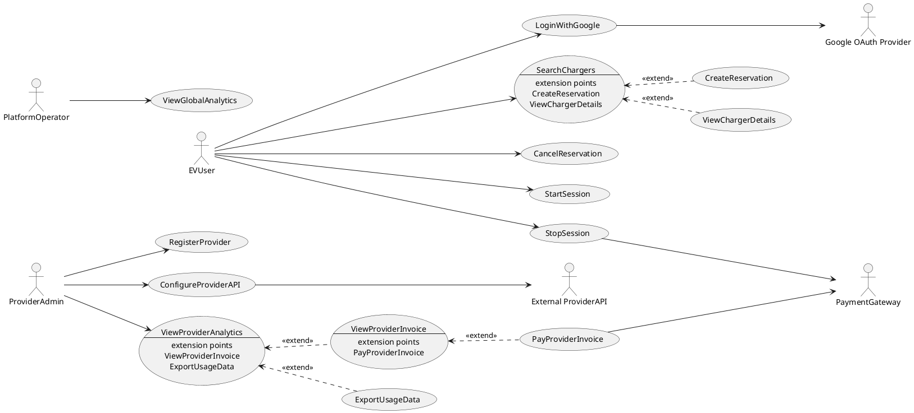

---

## 2. Activity Diagrams

Source folder: [`Activity_diagramms/`](./Activity_diagramms/)

### 2.1 Login / Search Chargers / View Charger

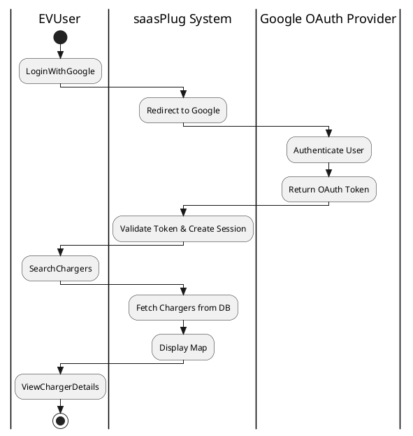

### 2.2 Create / Cancel Reservation

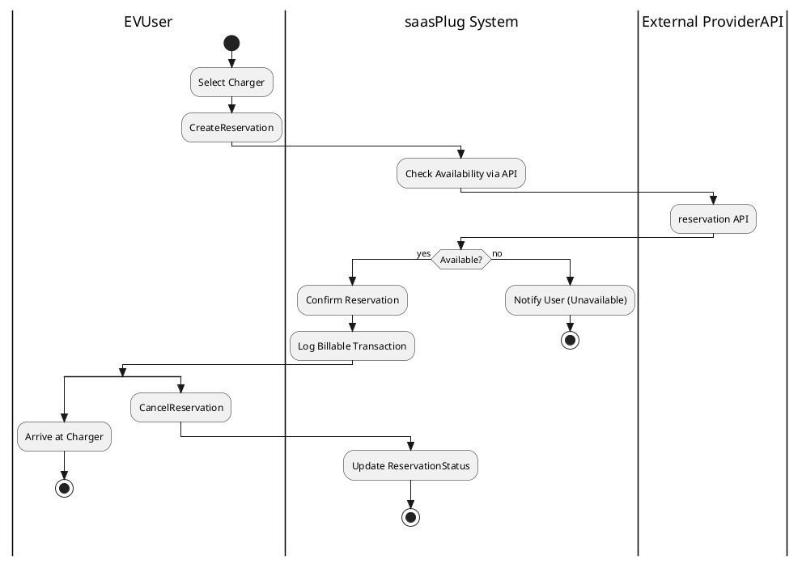

### 2.3 Start / Stop Session — Payment

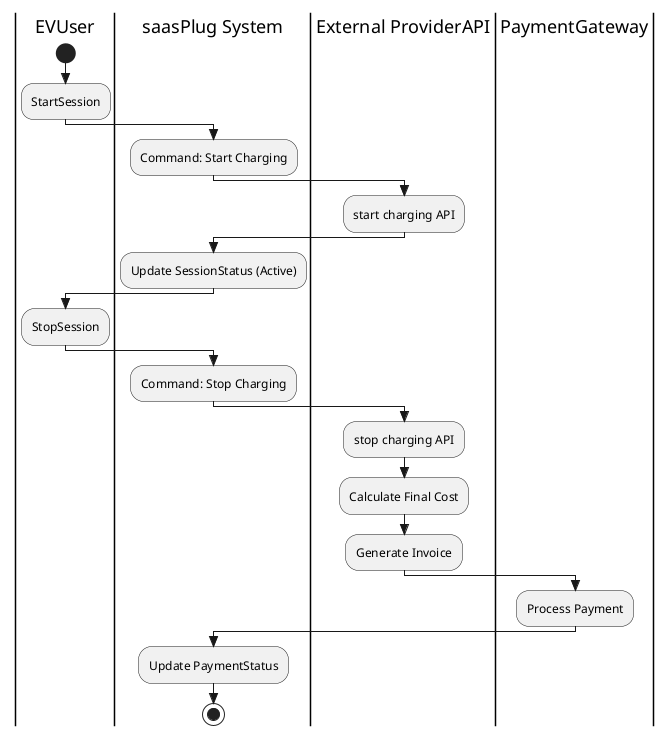

### 2.4 Register Provider / Configure API / Analytics / Export

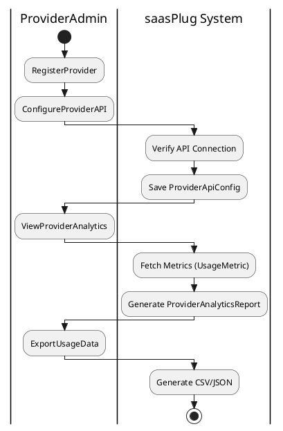

### 2.5 View / Pay Provider Invoice

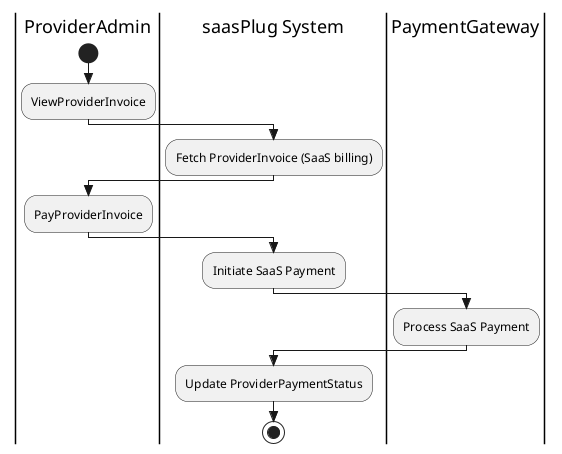

### 2.6 View Global Analytics

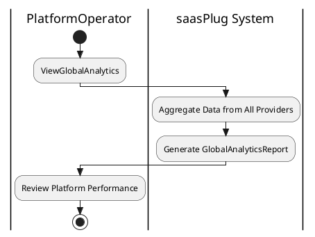

---

## 3. ER Diagram — Persistency

Source: [`ER.puml`](./ER.puml)

```plantuml
@startuml
skinparam classAttributeIconSize 0
skinparam monochrome true
skinparam linetype ortho
skinparam nodesep 50
skinparam ranksep 60

title saasPlug – Entity-Relationship Diagram

enum Role {
    EV_USER
    PROVIDER_ADMIN
    PLATFORM_OPERATOR
}
enum CarColor {
    RED
    BLUE
    YELLOW
    WHITE
    BLACK
    SILVER
    GREY
    GREEN
    ORANGE
    PURPLE
}
enum ChargerStatus {
    AVAILABLE
    IN_USE
    OUTAGE
    RESERVED
    MALFUNCTION
    OFFLINE
}
enum ConnectorType {
    CCS
    CHADEMO
    TYPE2
    TYPE1
    SCHUKO
}
enum ReservationStatus {
    ACTIVE
    EXPIRED
    CANCELLED
}
enum SessionStatus {
    RUNNING
    COMPLETED
    AUTO_STOPPED
    USER_STOPPED
    INSUFFICIENT_FUNDS
}
enum PaymentStatus {
    PREAUTHORIZED
    CAPTURED
    CANCELLED
    FAILED
}
enum ProviderStatus {
    ACTIVE
    SUSPENDED
    PENDING
}
enum SubscriptionStatus {
    ACTIVE
    CANCELLED
    PAST_DUE
}
enum ProviderInvoiceStatus {
    PENDING
    PAID
    OVERDUE
    VOID
}
enum ProviderPaymentStatus {
    PENDING
    COMPLETED
    FAILED
    REFUNDED
}
enum ExportStatus {
    PENDING
    PROCESSING
    COMPLETED
    FAILED
}
enum ExportFormat {
    CSV
    JSON
    XLSX
}
enum WebhookStatus {
    PENDING
    SENT
    FAILED
}

entity User {
    * id : Integer <<PK>>
    --
    * email : String <<unique>>
    * firstName : String
    * lastName : String
    * role : Role
    phone : String
    outstandingBalanceEur : Float
    * createdAt : Timestamp
}
entity AuthSession {
    * id : Integer <<PK>>
    --
    * userId : Integer <<FK>>
    * token : String
    * issuedAt : Timestamp
    * expiresAt : Timestamp
    provider : String
}
entity Car {
    * id : Integer <<PK>>
    --
    * brand : String
    * model : String
    * usableBatteryKWh : Float
    * acMaxKW : Float
    * dcMaxKW : Float
    dcPorts : ConnectorType[]
}
entity CarOwnership {
    * id : Integer <<PK>>
    --
    * userId : Integer <<FK>>
    * carId : Integer <<FK>>
    * color : CarColor
    licensePlate : String
    * createdAt : Timestamp
}
entity Charger {
    * id : Integer <<PK>>
    --
    * pointId : String <<unique>>
    * providerId : Integer <<FK>>
    * name : String
    * lat : Float
    * lon : Float
    * connectorType : ConnectorType
    * status : ChargerStatus
    cap : Integer
    * pricingProfileId : Integer <<FK>>
}
entity PricingProfile {
    * id : Integer <<PK>>
    --
    * name : String
    * kwhPrice : Float
    startFeeEur : Float
    minutePrice : Float
    currency : String
}
entity WholesalePricePoint {
    * id : Integer <<PK>>
    --
    * pricingProfileId : Integer <<FK>>
    * fromKW : Float
    * toKW : Float
    * pricePerKWh : Float
    * validFrom : Timestamp
    validTo : Timestamp
}
entity Reservation {
    * id : Integer <<PK>>
    --
    * userId : Integer <<FK>>
    * chargerId : Integer <<FK>>
    * status : ReservationStatus
    * startsAt : Timestamp
    * reservationEndTime : Timestamp
    paymentIntentId : String
    * createdAt : Timestamp
}
entity Session {
    * id : Integer <<PK>>
    --
    * userId : Integer <<FK>>
    * chargerId : Integer <<FK>>
    reservationId : Integer <<FK>>
    * status : SessionStatus
    * startedAt : Timestamp
    endedAt : Timestamp
    startSoc : Integer
    endSoc : Integer
    totalKWh : Float
    pricePerKWh : Float
    amount : Float
}
entity PaymentMethod {
    * id : Integer <<PK>>
    --
    * userId : Integer <<FK>>
    * provider : String
    * tokenLast4 : String
    isDefault : Boolean
    * createdAt : Timestamp
}
entity PaymentAuth {
    * id : Integer <<PK>>
    --
    * sessionId : Integer <<FK>>
    * paymentMethodId : Integer <<FK>>
    * status : PaymentStatus
    * authorizedAmountEur : Float
    capturedAmountEur : Float
    * createdAt : Timestamp
}
entity Invoice {
    * id : Integer <<PK>>
    --
    * userId : Integer <<FK>>
    * sessionId : Integer <<FK>>
    * totalEur : Float
    pdfUrl : String
    * issuedAt : Timestamp
}
entity Provider {
    * id : Integer <<PK>>
    --
    * name : String
    * email : String
    * status : ProviderStatus
    vatNumber : String
    address : String
    * createdAt : Timestamp
}
entity ProviderAccount {
    * id : Integer <<PK>>
    --
    * providerId : Integer <<FK>>
    * userId : Integer <<FK>>
    isOwner : Boolean
    * createdAt : Timestamp
}
entity ProviderApiConfig {
    * id : Integer <<PK>>
    --
    * providerId : Integer <<FK>>
    * baseUrl : String
    authToken : String
    * syncInterval : Integer
    * createdAt : Timestamp
    lastSyncedAt : Timestamp
}
entity ProviderPlan {
    * id : Integer <<PK>>
    --
    * name : String
    * monthlyFeeEur : Float
    * perSessionFeeEur : Float
    * maxChargers : Integer
}
entity ProviderSubscription {
    * id : Integer <<PK>>
    --
    * providerId : Integer <<FK>>
    * planId : Integer <<FK>>
    * status : SubscriptionStatus
    * startDate : Date
    endDate : Date
}
entity ProviderUsageRecord {
    * id : Integer <<PK>>
    --
    * providerId : Integer <<FK>>
    * billingPeriodId : Integer <<FK>>
    * totalSessions : Integer
    * totalKWh : Float
    * chargeableFeeEur : Float
    * recordedAt : Timestamp
}
entity BillingPeriod {
    * id : Integer <<PK>>
    --
    * providerId : Integer <<FK>>
    * startDate : Date
    * endDate : Date
    * isClosed : Boolean
}
entity ProviderInvoice {
    * id : Integer <<PK>>
    --
    * providerId : Integer <<FK>>
    * billingPeriodId : Integer <<FK>>
    * totalEur : Float
    * status : ProviderInvoiceStatus
    pdfUrl : String
    * issuedAt : Timestamp
    dueDate : Date
}
entity ProviderPayment {
    * id : Integer <<PK>>
    --
    * providerInvoiceId : Integer <<FK>>
    * status : ProviderPaymentStatus
    * amountEur : Float
    * paidAt : Timestamp
    transactionRef : String
}
entity ProviderAnalyticsReport {
    * id : Integer <<PK>>
    --
    * providerId : Integer <<FK>>
    * periodStart : Date
    * periodEnd : Date
    * totalSessions : Integer
    * totalKWh : Float
    * totalRevenueEur : Float
    * generatedAt : Timestamp
}
entity GlobalAnalyticsReport {
    * id : Integer <<PK>>
    --
    * periodStart : Date
    * periodEnd : Date
    * totalProviders : Integer
    * totalSessions : Integer
    * totalKWh : Float
    * platformRevenueEur : Float
    * generatedAt : Timestamp
}
entity UsageMetric {
    * id : Integer <<PK>>
    --
    * providerId : Integer <<FK>>
    * metricName : String
    * metricValue : Float
    * recordedAt : Timestamp
}
entity ExportJob {
    * id : Integer <<PK>>
    --
    * providerId : Integer <<FK>>
    * requestedBy : Integer <<FK>>
    * status : ExportStatus
    * format : ExportFormat
    * requestedAt : Timestamp
    completedAt : Timestamp
    downloadUrl : String
}
entity WebhookSubscription {
    * id : Integer <<PK>>
    --
    * providerId : Integer <<FK>>
    * targetUrl : String
    * eventType : String
    * isActive : Boolean
    * createdAt : Timestamp
}
entity WebhookEvent {
    * id : Integer <<PK>>
    --
    * subscriptionId : Integer <<FK>>
    * eventType : String
    * payload : Text
    * sentAt : Timestamp
    * status : WebhookStatus
}
entity AuditEvent {
    * id : Integer <<PK>>
    --
    userId : Integer <<FK>>
    sessionId : Integer <<FK>>
    * action : String
    * entityType : String
    entityId : Integer
    * occurredAt : Timestamp
    metadata : Text
}

User ||--o{ AuthSession : "has"
User ||--o{ CarOwnership : "owns"
CarOwnership }o--|| Car : "references"
Provider ||--o{ Charger : "manages"
Charger }o--|| PricingProfile : "uses"
PricingProfile ||--o{ WholesalePricePoint : "defines"
User ||--o{ Reservation : "creates"
Charger ||--o{ Reservation : "targeted by"
Reservation ||--o| Session : "may start"
User ||--o{ Session : "starts"
Charger ||--o{ Session : "hosts"
User ||--o{ PaymentMethod : "owns"
Session ||--|| PaymentAuth : "authorised via"
PaymentAuth }o--|| PaymentMethod : "uses"
Session ||--o| Invoice : "generates"
Invoice }o--|| User : "billed to"
Provider ||--o{ ProviderAccount : "has"
ProviderAccount }o--|| User : "linked to"
Provider ||--|| ProviderApiConfig : "configured by"
Provider ||--o{ ProviderSubscription : "subscribes"
ProviderSubscription }o--|| ProviderPlan : "using"
Provider ||--o{ BillingPeriod : "has"
BillingPeriod ||--o{ ProviderUsageRecord : "records"
BillingPeriod ||--o| ProviderInvoice : "generates"
ProviderInvoice ||--o{ ProviderPayment : "settled by"
Provider ||--o{ ProviderAnalyticsReport : "reported in"
Provider ||--o{ UsageMetric : "tracks"
Provider ||--o{ ExportJob : "requests"
ExportJob }o--|| User : "requested by"
Provider ||--o{ WebhookSubscription : "subscribes"
WebhookSubscription ||--o{ WebhookEvent : "triggers"
AuditEvent }o--o| User : "references"
AuditEvent }o--o| Session : "references"
@enduml
```

---

## 4. Class Diagram — Data Structures (DTOs & Enums)

Source: [`Class(DataStruct).puml`](<./Class(DataStruct).puml>)

```plantuml
@startuml
skinparam classAttributeIconSize 0
skinparam monochrome true
skinparam linetype ortho

package "Enums" {
    enum Role {
        EV_USER
        PROVIDER_ADMIN
        PLATFORM_OPERATOR
    }
    enum ChargerStatus {
        AVAILABLE
        IN_USE
        OUTAGE
        RESERVED
        MALFUNCTION
        OFFLINE
    }
    enum ConnectorType {
        CCS
        CHADEMO
        TYPE2
        TYPE1
        SCHUKO
    }
    enum ReservationStatus {
        ACTIVE
        EXPIRED
        CANCELLED
    }
    enum SessionStatus {
        RUNNING
        COMPLETED
        AUTO_STOPPED
        USER_STOPPED
        INSUFFICIENT_FUNDS
    }
    enum PaymentStatus {
        PREAUTHORIZED
        CAPTURED
        CANCELLED
        FAILED
    }
    enum CarColor {
        RED
        BLUE
        YELLOW
        WHITE
        BLACK
        SILVER
        GREY
        GREEN
        ORANGE
        PURPLE
    }
    enum ProviderStatus {
        PENDING
        ACTIVE
        SUSPENDED
        DISABLED
    }
    enum SubscriptionStatus {
        TRIAL
        ACTIVE
        PAST_DUE
        CANCELLED
    }
    enum ProviderInvoiceStatus {
        PENDING
        PAID
        OVERDUE
        CANCELLED
    }
    enum ProviderPaymentStatus {
        PENDING
        SUCCEEDED
        FAILED
        CANCELLED
    }
    enum ExportStatus {
        PENDING
        RUNNING
        COMPLETED
        FAILED
    }
    enum ExportFormat {
        CSV
        JSON
    }
}

package "DTOs - Identity & Vehicles" {
    class UserDto {
        + id: Integer
        + email: String
        + firstName: String
        + lastName: String
        + phone: String
        + outstandingBalanceEur: Float
        + createdAt: String
    }
    class CarDto {
        + id: Integer
        + brand: String
        + model: String
        + usableBatteryKWh: Float
        + acMaxKW: Float
        + dcMaxKW: Float
        + dcPorts: ConnectorType[]
    }
    class CarOwnershipDto {
        + id: Integer
        + userId: Integer
        + carId: Integer
        + carColor: CarColor
        + createdAt: String
    }
}

package "DTOs - Charging & Catalog" {
    class ChargerDto {
        + pointId: String
        + providerName: String
        + name: String
        + lat: Float
        + lon: Float
        + cap: Integer
        + kWhPrice: Float
    }
    class ChargerSummaryDto
    class ChargerDetailsDto
    class PricingProfileDto {
        + id: Integer
        + providerName: String
        + currency: String
        + basePricePerKWh: Float
    }
    class WholesalePricePointDto {
        + id: Integer
        + startsAt: String
        + endsAt: String
        + pricePerKWh: Float
    }
}

package "DTOs - Reservations & Sessions" {
    class ReservationDto {
        + id: Integer
        + userId: Integer
        + chargerId: Integer
        + startsAt: String
        + reservationEndTime: String
        + paymentIntentId: String
    }
    class ReservationSummaryDto
    class ReservationDetailsDto
    class SessionDto {
        + id: Integer
        + userId: Integer
        + chargerId: Integer
        + reservationId: Integer
        + startedAt: String
        + endedAt: String
        + startSoc: Integer
        + endSoc: Integer
        + totalKWh: Float
        + pricePerKWh: Float
        + amount: Float
    }
}

package "DTOs - Billing (User-side)" {
    class PaymentMethodDto {
        + id: Integer
        + userId: Integer
        + provider: String
        + tokenLast4: String
    }
    class PaymentAuthDto {
        + id: Integer
        + sessionId: Integer
        + status: PaymentStatus
        + authorizedAmountEur: Float
    }
    class InvoiceDto {
        + id: Integer
        + userId: Integer
        + sessionId: Integer
        + pdfUrl: String
        + totalEur: Float
    }
}

package "DTOs - Provider / SaaS & Analytics" {
    class ProviderDto {
        + id: Integer
        + name: String
        + status: ProviderStatus
    }
    class ProviderInvoiceDto {
        + id: Integer
        + providerId: Integer
        + totalEur: Float
        + status: ProviderInvoiceStatus
    }
    class ProviderAnalyticsReportDto {
        + totalSessions: Integer
        + totalRevenueEur: Float
        + period: String
    }
    class GlobalAnalyticsReportDto {
        + totalProviders: Integer
        + totalSessions: Integer
        + totalRevenueEur: Float
        + period: String
    }
    class ExportJobDto {
        + id: Integer
        + providerId: Integer
        + format: ExportFormat
        + status: ExportStatus
        + fileUrl: String
    }
    class ProviderApiConfigDto {
        + id: Integer
        + providerId: Integer
        + baseUrl: String
        + apiKey: String
        + clientSecret: String
    }
    class ProviderSubscriptionDto {
        + id: Integer
        + providerId: Integer
        + planName: String
        + status: SubscriptionStatus
        + startsAt: String
        + endsAt: String
    }
    class InvoiceLineDto {
        + id: Integer
        + providerInvoiceId: Integer
        + description: String
        + amountEur: Float
    }
    class ProviderPaymentDto {
        + id: Integer
        + providerInvoiceId: Integer
        + amountEur: Float
        + status: ProviderPaymentStatus
        + gatewayTransactionId: String
        + createdAt: String
    }
    class UsageMetricDto {
        + chargerId: Integer
        + date: String
        + sessionsCount: Integer
        + totalKWh: Float
        + totalRevenueEur: Float
    }
}

package "DTOs - Integration & Audit" {
    class WebhookEventDto {
        + id: Integer
        + eventType: String
        + deliveredAt: String
    }
    class AuditEventDto {
        + id: Integer
        + eventType: String
        + createdAt: String
    }
}

ChargerSummaryDto --|> ChargerDto
ChargerDetailsDto --|> ChargerDto
ReservationSummaryDto --|> ReservationDto
ReservationDetailsDto --|> ReservationDto

UserDto --> Role
CarOwnershipDto --> UserDto
CarOwnershipDto --> CarDto

ChargerDto --> ChargerStatus
ChargerDto --> ConnectorType
PricingProfileDto --> WholesalePricePointDto

ReservationDto --> UserDto
ReservationDto --> ChargerDto
ReservationDto --> ReservationStatus

SessionDto --> UserDto
SessionDto --> ChargerDto
SessionDto --> ReservationDto
SessionDto --> SessionStatus

PaymentMethodDto --> UserDto
PaymentAuthDto --> SessionDto
PaymentAuthDto --> PaymentStatus
InvoiceDto --> SessionDto
InvoiceDto --> UserDto

ProviderDto --> ProviderStatus
ProviderInvoiceDto --> ProviderDto
ProviderInvoiceDto --> ProviderInvoiceStatus
ProviderInvoiceDto --> InvoiceLineDto
ProviderAnalyticsReportDto --> ProviderDto
ProviderApiConfigDto --> ProviderDto
ProviderSubscriptionDto --> SubscriptionStatus
ProviderSubscriptionDto --> ProviderDto
ProviderPaymentDto --> ProviderPaymentStatus
ProviderPaymentDto --> ProviderInvoiceDto
ExportJobDto --> ProviderDto
ExportJobDto --> ExportStatus
ExportJobDto --> ExportFormat
UsageMetricDto --> ChargerDto
@enduml
```

---

## 5. Class Diagram — APIs (Controllers & Request/Response)

Source: [`Class(APIs).puml`](<./Class(APIs).puml>)

```plantuml
@startuml
skinparam classAttributeIconSize 0
skinparam monochrome true
skinparam linetype ortho

package "AuthService" {
    package "API Request/Response Models" {
        class GoogleLoginRequest {
            + authCode: String
        }
        class AuthTokenResponse{
            + jwt: String
            + role: Role
        }
    }
    package "REST API Controllers (Endpoints)" {
        class AuthController <<RestController>> {
            + <<POST>> /api/auth/google(req: GoogleLoginRequest): AuthTokenResponse
        }
    }
    AuthController ..up.> GoogleLoginRequest
    AuthController ..up.> AuthTokenResponse
}

package "UserService" {
    package "REST API Controllers (Endpoints)" {
        class UserController <<RestController>> {
            + <<GET>> /api/users/profile(): UserDto
            + <<PUT>> /api/users/preferences(req: Json): UserDto
        }
    }
    UserController ..up.> UserDto
}

package "VehicleService" {
    package "REST API Controllers (Endpoints)" {
        class VehicleController <<RestController>> {
            + <<GET>> /api/vehicles(): CarOwnershipDto[]
            + <<POST>> /api/vehicles(req: CarDto): CarOwnershipDto
        }
    }
    VehicleController ..up.> CarDto
    VehicleController ..up.> CarOwnershipDto
}

package "ChargerService" {
    package "API Request/Response Models" {
        class SearchChargersRequest <<QueryParams>> {
            + lat: Float
            + lon: Float
            + radiusKm: Float
        }
        class SearchChargersResponse {
            + chargers: ChargerSummaryDto[]
        }
        class GetChargerDetailsResponse {
            + charger: ChargerDetailsDto
        }
    }
    package "REST API Controllers (Endpoints)" {
        class ChargerController <<RestController>> {
            + <<GET>> /api/chargers(params: SearchChargersRequest): SearchChargersResponse
            + <<GET>> /api/chargers/{id}(id: String): GetChargerDetailsResponse
        }
    }
    ChargerController ..up.> SearchChargersRequest
    ChargerController ..up.> SearchChargersResponse
    ChargerController ..up.> GetChargerDetailsResponse
}

package "ReservationService" {
    package "API Request/Response Models" {
        class CreateReservationRequest {
            + chargerId: Integer
            + startsAt: String
            + endsAt: String
        }
        class CreateReservationResponse {
            + reservation: ReservationDto
        }
        class CancelReservationRequest {
            + reason: String
        }
        class ReservationResponse {
            + reservation: ReservationDto
        }
    }
    package "REST API Controllers (Endpoints)" {
        class ReservationController <<RestController>> {
            + <<POST>> /api/reservations(req: CreateReservationRequest): CreateReservationResponse
            + <<DELETE>> /api/reservations/{id}(req: CancelReservationRequest): ReservationResponse
        }
    }
    ReservationController ..up.> CreateReservationRequest
    ReservationController ..up.> CreateReservationResponse
    ReservationController ..up.> CancelReservationRequest
    ReservationController ..up.> ReservationResponse
}

package "SessionService" {
    package "API Request/Response Models" {
        class StartSessionRequest {
            + chargerId: Integer
            + reservationId: Integer
        }
        class StartSessionResponse {
            + session: SessionDto
        }
        class StopSessionRequest {
            + sessionId: Integer
        }
        class StopSessionResponse {
            + session: SessionDto
            + invoice: InvoiceDto
        }
    }
    package "REST API Controllers (Endpoints)" {
        class SessionController <<RestController>> {
            + <<POST>> /api/sessions/start(req: StartSessionRequest): StartSessionResponse
            + <<POST>> /api/sessions/stop(req: StopSessionRequest): StopSessionResponse
        }
    }
    SessionController ..up.> StartSessionRequest
    SessionController ..up.> StartSessionResponse
    SessionController ..up.> StopSessionRequest
    SessionController ..up.> StopSessionResponse
}

package "BillingService" {
    package "API Request/Response Models" {
        class AddPaymentMethodRequest {
            + paymentToken: String
        }
        class PaymentMethodResponse {
            + method: PaymentMethodDto
        }
        class PaymentAuthorizationResponse {
            + status: PaymentStatus
            + amountAuthorizedEur: Float
        }
        class PayProviderInvoiceRequest {
            + paymentMethodId: Integer
        }
        class PayProviderInvoiceResponse {
            + success: Boolean
        }
        class GetProviderInvoiceResponse {
            + invoice: ProviderInvoiceDto
        }
        class InvoiceResponse {
            + invoice: InvoiceDto
        }
    }
    package "REST API Controllers (Endpoints)" {
        class BillingController <<RestController>> {
            + <<POST>> /api/billing/methods(req: AddPaymentMethodRequest): PaymentMethodResponse
            + <<GET>> /api/billing/invoices/{id}(id: Integer): GetProviderInvoiceResponse
            + <<POST>> /api/billing/pay(req: PayProviderInvoiceRequest): PayProviderInvoiceResponse
        }
    }
    BillingController ..up.> AddPaymentMethodRequest
    BillingController ..up.> PaymentMethodResponse
    BillingController ..up.> PayProviderInvoiceRequest
    BillingController ..up.> PayProviderInvoiceResponse
    BillingController ..up.> GetProviderInvoiceResponse
}

package "ProviderService" {
    package "API Request/Response Models" {
        class RegisterProviderRequest {
            + name: String
            + adminEmail: String
        }
        class RegisterProviderResponse {
            + provider: ProviderDto
        }
        class ProviderProfileResponse {
            + provider: ProviderDto
        }
    }
    package "REST API Controllers (Endpoints)" {
        class ProviderController <<RestController>> {
            + <<POST>> /api/providers/register(req: RegisterProviderRequest): RegisterProviderResponse
            + <<PUT>> /api/providers/{id}/config(): ProviderProfileResponse
        }
    }
    ProviderController ..up.> RegisterProviderRequest
    ProviderController ..up.> RegisterProviderResponse
    ProviderController ..up.> ProviderProfileResponse
}

package "AnalyticsService" {
    package "API Request/Response Models" {
        class GetProviderAnalyticsRequest <<QueryParams>> {
            + startDate: String
            + endDate: String
        }
        class ProviderAnalyticsResponse {
            + report: ProviderAnalyticsReportDto
        }
        class GetGlobalAnalyticsRequest <<QueryParams>> {
            + startDate: String
            + endDate: String
        }
        class GlobalAnalyticsResponse {
            + report: GlobalAnalyticsReportDto
        }
        class ExportUsageDataRequest {
            + startDate: String
            + endDate: String
            + format: ExportFormat
        }
        class ExportUsageDataResponse {
            + job: ExportJobDto
        }
    }
    package "REST API Controllers (Endpoints)" {
        class AnalyticsController <<RestController>> {
            + <<GET>> /api/analytics/provider(params: GetProviderAnalyticsRequest): ProviderAnalyticsResponse
            + <<GET>> /api/analytics/global(params: GetGlobalAnalyticsRequest): GlobalAnalyticsResponse
            + <<POST>> /api/analytics/export(req: ExportUsageDataRequest): ExportUsageDataResponse
        }
    }
    AnalyticsController ..up.> GetProviderAnalyticsRequest
    AnalyticsController ..up.> ProviderAnalyticsResponse
    AnalyticsController ..up.> GetGlobalAnalyticsRequest
    AnalyticsController ..up.> GlobalAnalyticsResponse
    AnalyticsController ..up.> ExportUsageDataRequest
    AnalyticsController ..up.> ExportUsageDataResponse
}

package "IntegrationService" {
    package "REST API Controllers (Endpoints)" {
        class WebhookController <<RestController>> {
            + <<POST>> /api/webhooks/receive(req: WebhookEventDto): String
        }
    }
    WebhookController ..up.> WebhookEventDto
}
@enduml
```

---

## 6. Component Diagram

Source: [`Component.puml`](./Component.puml)

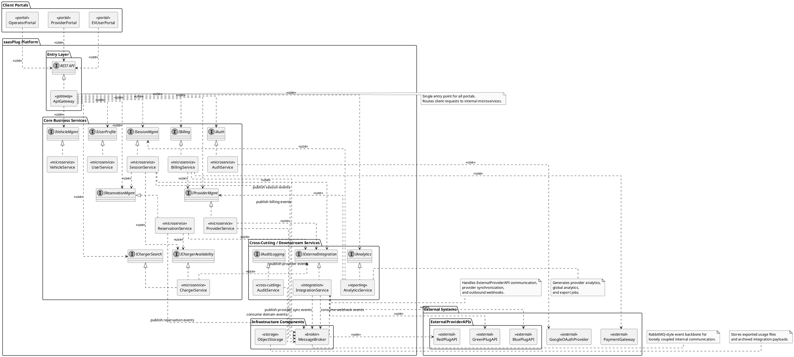

---

## 7. Deployment Diagram

Source: [`Deployment.puml`](./Deployment.puml)

```plantuml
@startuml
title saasPlug - Deployment Diagram

skinparam componentStyle rectangle
skinparam shadowing false
skinparam linetype ortho
skinparam defaultTextAlignment center

legend right
  == Canonical Notes ==
  * Docker-based microservices deployment
  * Ports explicitly shown
  * Hybrid communication:
    - synchronous REST via ApiGateway
    - asynchronous messaging via RabbitMQ
  * Export files stored in MinIO
endlegend

node "Client Devices" <<device>> {
  node "EVUser Browser" as EVUserBrowser
  node "ProviderAdmin Browser" as ProviderAdminBrowser
  node "PlatformOperator Browser" as PlatformOperatorBrowser
}

cloud "GoogleOAuthProvider" as GoogleOAuthProvider
cloud "ExternalProviderAPI" as ExternalProviderAPI
cloud "PaymentGateway" as PaymentGateway

node "Docker Host / VM" <<device>> {

  node "Docker Network: saasplug-network" <<network>> {

    node "ev-user-portal-container" <<container>> {
      artifact "EVUserPortal\nReact SPA\nPort: 3000" as EVUserPortal
    }
    node "provider-portal-container" <<container>> {
      artifact "ProviderPortal\nReact SPA\nPort: 3001" as ProviderPortal
    }
    node "operator-portal-container" <<container>> {
      artifact "OperatorPortal\nReact SPA\nPort: 3002" as OperatorPortal
    }
    node "api-gateway-container" <<container>> {
      artifact "ApiGateway\nPort: 8080" as ApiGateway
    }
    node "message-broker-container" <<container>> {
      artifact "RabbitMQ MessageBroker\nAMQP: 5672\nManagement: 15672" as MessageBroker
    }
    node "auth-service-container" <<container>> {
      artifact "AuthService\nPort: 8081" as AuthService
    }
    node "user-service-container" <<container>> {
      artifact "UserService\nPort: 8082" as UserService
    }
    node "vehicle-service-container" <<container>> {
      artifact "VehicleService\nPort: 8083" as VehicleService
    }
    node "charger-service-container" <<container>> {
      artifact "ChargerService\nPort: 8084" as ChargerService
    }
    node "reservation-service-container" <<container>> {
      artifact "ReservationService\nPort: 8085" as ReservationService
    }
    node "session-service-container" <<container>> {
      artifact "SessionService\nPort: 8086" as SessionService
    }
    node "billing-service-container" <<container>> {
      artifact "BillingService\nPort: 8087" as BillingService
    }
    node "provider-service-container" <<container>> {
      artifact "ProviderService\nPort: 8088" as ProviderService
    }
    node "analytics-service-container" <<container>> {
      artifact "AnalyticsService\nPort: 8089" as AnalyticsService
    }
    node "integration-service-container" <<container>> {
      artifact "IntegrationService\nPort: 8090" as IntegrationService
    }
    node "audit-service-container" <<container>> {
      artifact "AuditService\nPort: 8091" as AuditService
    }
    node "redis-container" <<container>> {
      artifact "Redis\nPort: 6379" as Redis
    }
    node "minio-container" <<container>> {
      artifact "MinIO ObjectStorage\nAPI: 9000\nConsole: 9001" as MinIO
    }
    node "monitoring-container" <<container>> {
      artifact "Monitoring\nPrometheus / Grafana\nPorts: 9090 / 3003" as Monitoring
    }
    node "log-aggregation-container" <<container>> {
      artifact "LogAggregation\nPorts: 3100 / 5601" as LogAggregation
    }

    database "auth-db-container" <<container>> {
      artifact "Auth DB\nPort: 5433" as AuthDB
    }
    database "user-db-container" <<container>> {
      artifact "User DB\nPort: 5434" as UserDB
    }
    database "vehicle-db-container" <<container>> {
      artifact "Vehicle DB\nPort: 5435" as VehicleDB
    }
    database "charger-db-container" <<container>> {
      artifact "Charger DB\nPort: 5436" as ChargerDB
    }
    database "reservation-db-container" <<container>> {
      artifact "Reservation DB\nPort: 5437" as ReservationDB
    }
    database "session-db-container" <<container>> {
      artifact "Session DB\nPort: 5438" as SessionDB
    }
    database "billing-db-container" <<container>> {
      artifact "Billing DB\nPort: 5439" as BillingDB
    }
    database "provider-db-container" <<container>> {
      artifact "Provider DB\nPort: 5440" as ProviderDB
    }
    database "analytics-db-container" <<container>> {
      artifact "Analytics DB\nPort: 5441" as AnalyticsDB
    }
    database "integration-db-container" <<container>> {
      artifact "Integration DB\nPort: 5442" as IntegrationDB
    }
    database "audit-db-container" <<container>> {
      artifact "Audit DB\nPort: 5443" as AuditDB
    }
  }
}

EVUserBrowser --> EVUserPortal : HTTPS 443
ProviderAdminBrowser --> ProviderPortal : HTTPS 443
PlatformOperatorBrowser --> OperatorPortal : HTTPS 443

EVUserPortal --> ApiGateway : REST / JSON
ProviderPortal --> ApiGateway : REST / JSON
OperatorPortal --> ApiGateway : REST / JSON

ApiGateway --> AuthService
ApiGateway --> UserService
ApiGateway --> VehicleService
ApiGateway --> ChargerService
ApiGateway --> ReservationService
ApiGateway --> SessionService
ApiGateway --> BillingService
ApiGateway --> ProviderService
ApiGateway --> AnalyticsService
ApiGateway --> IntegrationService
ApiGateway --> AuditService

AuthService --> GoogleOAuthProvider : OAuth2
BillingService --> PaymentGateway : HTTPS
IntegrationService --> ExternalProviderAPI : HTTPS

AuthService --> AuthDB
UserService --> UserDB
VehicleService --> VehicleDB
ChargerService --> ChargerDB
ReservationService --> ReservationDB
SessionService --> SessionDB
BillingService --> BillingDB
ProviderService --> ProviderDB
AnalyticsService --> AnalyticsDB
IntegrationService --> IntegrationDB
AuditService --> AuditDB

ChargerService --> Redis : charger availability cache
ReservationService --> Redis : reservation lock / temporary hold
SessionService --> Redis : active session ephemeral state
ApiGateway --> Redis : optional token / rate-limit cache

AnalyticsService --> MinIO : store export files
IntegrationService --> MinIO : webhook payload archive

ReservationService --> MessageBroker : publish ReservationCreated / Cancelled
SessionService --> MessageBroker : publish SessionStarted / Stopped
ProviderService --> MessageBroker : publish Provider events
IntegrationService --> MessageBroker : publish ProviderSync / Webhook events

BillingService --> MessageBroker : consume Session + Provider events
AnalyticsService --> MessageBroker : consume domain events
AuditService --> MessageBroker : consume all events
IntegrationService --> MessageBroker : consume Provider sync events

ReservationService --> ChargerService : availability check
SessionService --> BillingService : invoice trigger
ProviderService --> IntegrationService : API config
AnalyticsService --> BillingService : usage data

ApiGateway --> Monitoring : metrics
AuthService --> Monitoring : metrics
UserService --> Monitoring : metrics
VehicleService --> Monitoring : metrics
ChargerService --> Monitoring : metrics
ReservationService --> Monitoring : metrics
SessionService --> Monitoring : metrics
BillingService --> Monitoring : metrics
ProviderService --> Monitoring : metrics
AnalyticsService --> Monitoring : metrics
IntegrationService --> Monitoring : metrics
AuditService --> Monitoring : metrics
MessageBroker --> Monitoring : broker metrics

ApiGateway --> LogAggregation : logs
AuthService --> LogAggregation : logs
UserService --> LogAggregation : logs
VehicleService --> LogAggregation : logs
ChargerService --> LogAggregation : logs
ReservationService --> LogAggregation : logs
SessionService --> LogAggregation : logs
BillingService --> LogAggregation : logs
ProviderService --> LogAggregation : logs
AnalyticsService --> LogAggregation : logs
IntegrationService --> LogAggregation : logs
AuditService --> LogAggregation : logs
MessageBroker --> LogAggregation : broker logs

note bottom of Redis
Redis:
- charger availability cache
- reservation lock / temporary hold
- active session ephemeral state
end note

note bottom of IntegrationService
IntegrationService:
- ExternalProviderAPI communication
- provider sync events
- outbound webhooks
end note

note bottom of MinIO
Used for ExportUsageData files
end note

note bottom of MessageBroker
RabbitMQ enables event-driven architecture
end note
@enduml
```

---

## 8. Sequence Diagrams

Source: [`Sequence.puml`](./Sequence.puml)

### 8.1 LoginWithGoogle

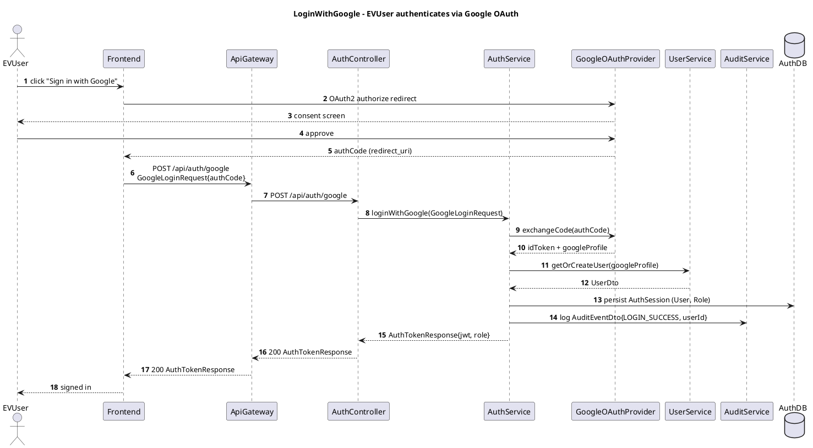

### 8.2 SearchChargers + ViewChargerDetails

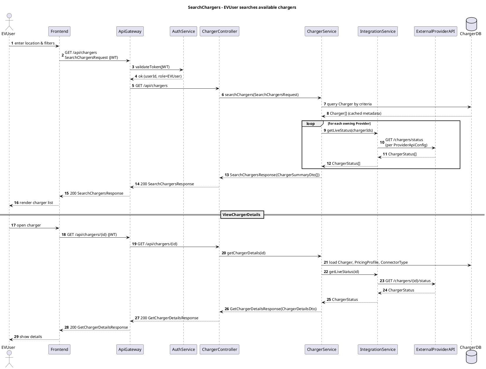

### 8.3 CreateReservation

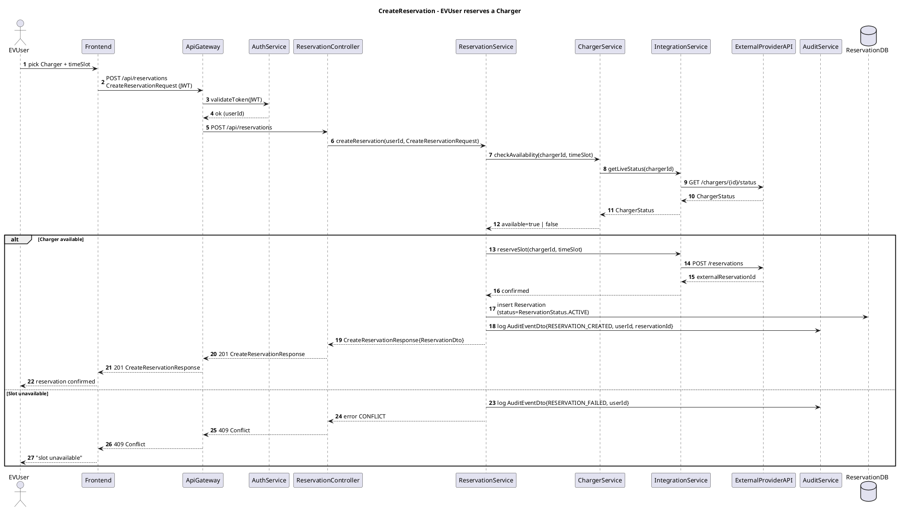

### 8.4 CancelReservation

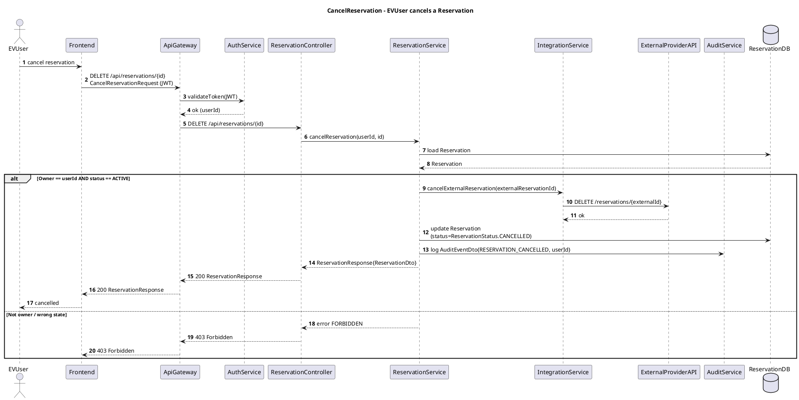

### 8.5 StartSession / StopSession

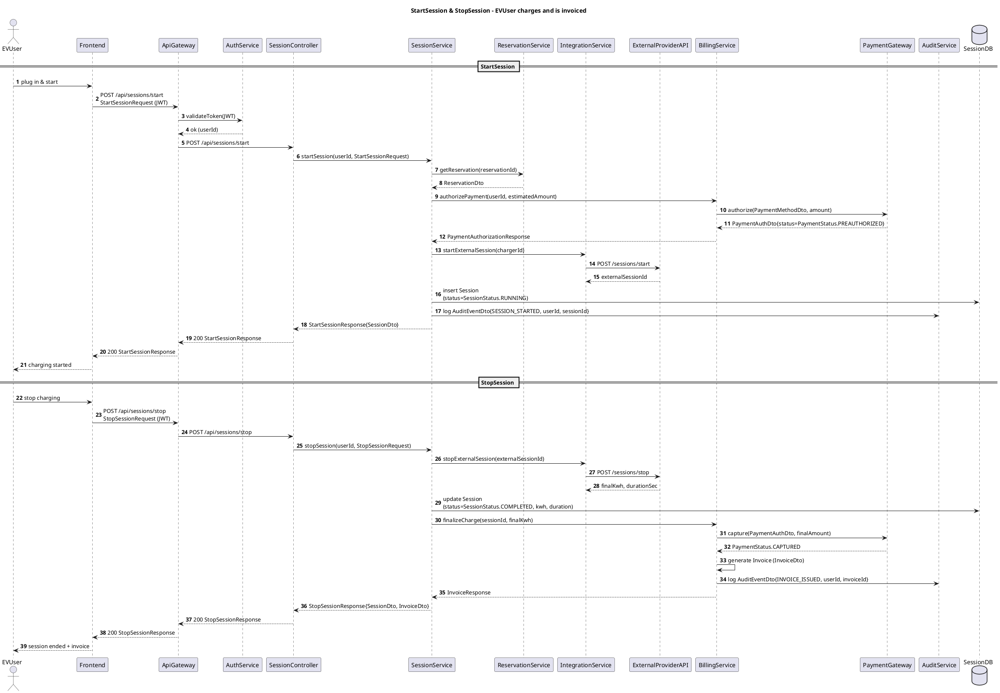

### 8.6 RegisterProvider + ConfigureProviderAPI

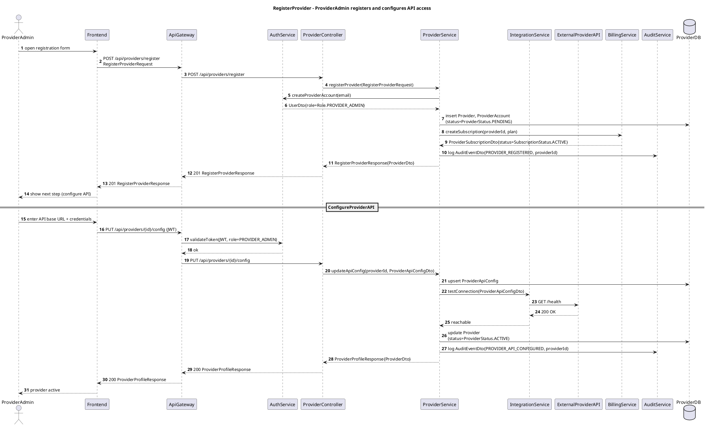

### 8.7 ViewProviderInvoice + PayProviderInvoice

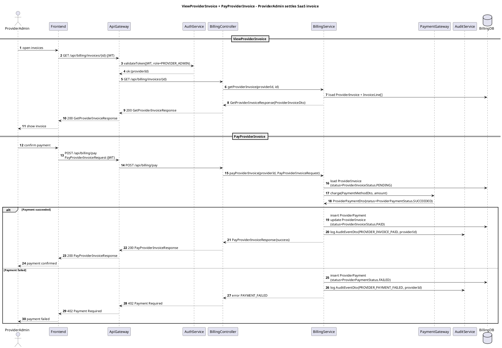

### 8.8 ViewProviderAnalytics + ExportUsageData

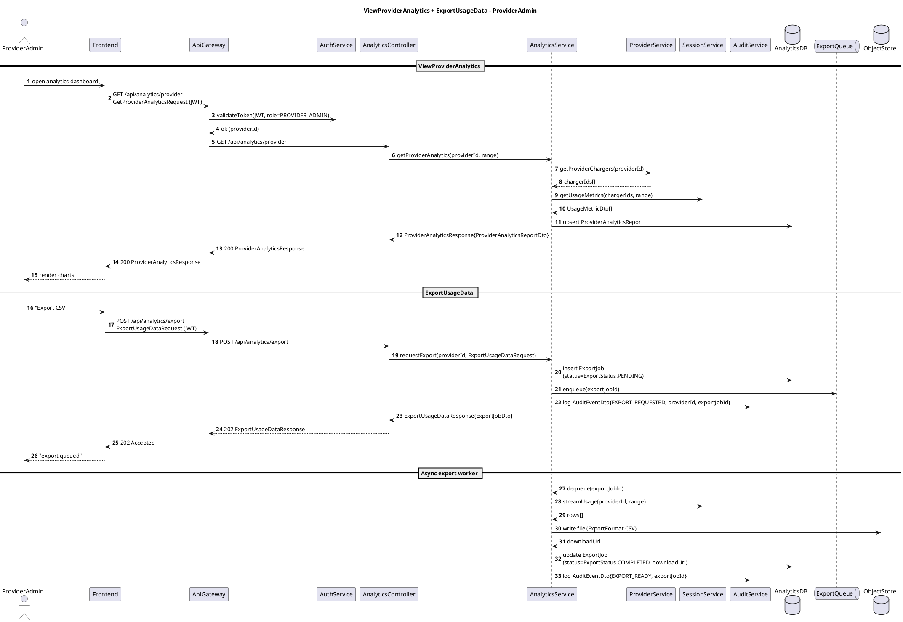

### 8.9 ViewGlobalAnalytics

```plantuml
@startuml
title ViewGlobalAnalytics - PlatformOperator

skinparam responseMessageBelowArrow true
autonumber

actor PlatformOperator
participant Frontend
participant ApiGateway
participant AuthService
participant AnalyticsController
participant AnalyticsService
participant ProviderService
participant SessionService
participant BillingService
participant AuditService
database "AnalyticsDB" as AnalyticsDB

PlatformOperator -> Frontend : open global dashboard
Frontend -> ApiGateway : GET /api/analytics/global\nGetGlobalAnalyticsRequest (JWT)
ApiGateway -> AuthService : validateToken(JWT, role=PLATFORM_OPERATOR)
AuthService --> ApiGateway : ok

ApiGateway -> AnalyticsController : GET /api/analytics/global
AnalyticsController -> AnalyticsService : getGlobalAnalytics(range)

par
    AnalyticsService -> ProviderService : getActiveProviders()
    ProviderService --> AnalyticsService : Provider[]
also
    AnalyticsService -> SessionService : getGlobalUsageMetrics(range)
    SessionService --> AnalyticsService : UsageMetricDto[]
also
    AnalyticsService -> BillingService : getRevenueSummary(range)
    BillingService --> AnalyticsService : revenueTotals
end

AnalyticsService -> AnalyticsDB : upsert GlobalAnalyticsReport
AnalyticsService -> AuditService : log AuditEventDto{GLOBAL_ANALYTICS_VIEWED}
AnalyticsService --> AnalyticsController : GlobalAnalyticsResponse{GlobalAnalyticsReportDto}
AnalyticsController --> ApiGateway : 200 GlobalAnalyticsResponse
ApiGateway --> Frontend : 200 GlobalAnalyticsResponse
Frontend --> PlatformOperator : render KPIs
@enduml
```

## Additional Project Documents

- Canonical naming and consistency sheet: [canonical-naming.md](canonical-naming.md)
- Reuse and migration plan from the previous EV charger project: [reuse-plan-from-softeng25-02.md](reuse-plan-from-softeng25-02.md)
- PlantUML model for the SaaS assignment: [saasplug-uml.md](saasplug-uml.md)
