# saasPlug UML Model

> Single consolidated PlantUML model (per assignment requirement). Each block below is copied verbatim from the corresponding standalone `.puml` file in this directory, so the two are always consistent. Last assembled: 2026-06-24.

## Contents
1. Use Case Diagram
2. Activity Diagrams
3. Class Diagram – Data Structures
4. Class Diagram – APIs
5. Persistency / ER Diagram
6. Component Diagram
7. Deployment Diagram
8. Sequence Diagrams

## Use Case Diagram

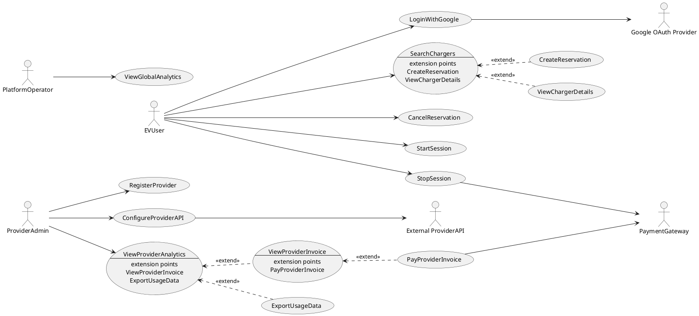

## Activity Diagrams

### Login with Google / Search Chargers / View Charger

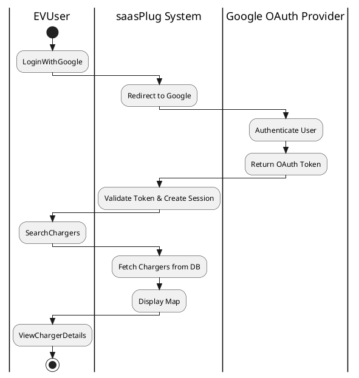

### Create Reservation

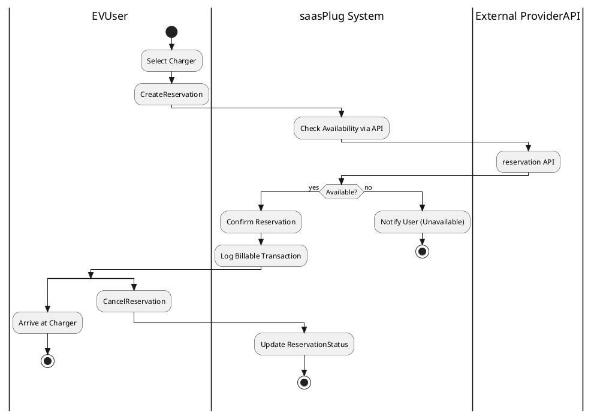

### Start / Stop Session & Payment

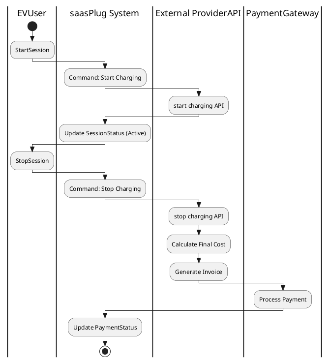

### Register Provider / Configure API / Provider Analytics / Export Usage

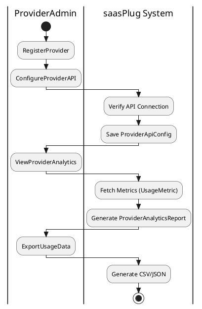

### View / Pay Provider Invoice

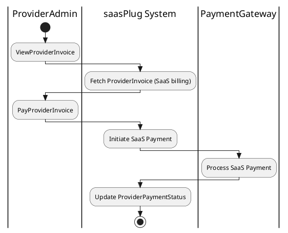

### View Global Analytics

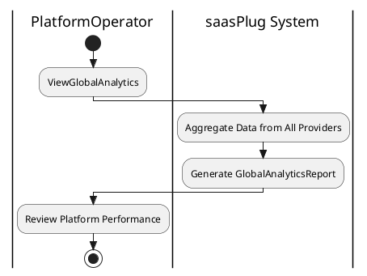

## Class Diagram – Data Structures

```plantuml
@startuml
skinparam classAttributeIconSize 0
skinparam monochrome true
skinparam linetype ortho

package "Enums" {
    enum Role {
        EV_USER
        PROVIDER_ADMIN
        PLATFORM_OPERATOR
    }
    
    enum ChargerStatus {
        AVAILABLE
        IN_USE
        OUTAGE
        RESERVED
        MALFUNCTION
        OFFLINE
    }
    
    enum ConnectorType {
        CCS
        CHADEMO
        TYPE2
        TYPE1
        SCHUKO
    }
    
    enum ReservationStatus {
        ACTIVE
        EXPIRED
        CANCELLED
    }
    
    enum SessionStatus {
        RUNNING
        COMPLETED
        AUTO_STOPPED
        USER_STOPPED
        INSUFFICIENT_FUNDS
    }
    
    enum PaymentStatus {
        PREAUTHORIZED
        CAPTURED
        CANCELLED
        FAILED
    }
    
    enum CarColor {
        RED
        BLUE
        YELLOW
        WHITE
        BLACK
        SILVER
        GREY
        GREEN
        ORANGE
        PURPLE
    }

    enum ProviderStatus {
        PENDING
        ACTIVE
        SUSPENDED
        DISABLED
    }

    enum SubscriptionStatus {
        TRIAL
        ACTIVE
        PAST_DUE
        CANCELLED
    }

    enum ProviderInvoiceStatus {
        PENDING
        PAID
        OVERDUE
        CANCELLED
    }

    enum ProviderPaymentStatus {
        PENDING
        SUCCEEDED
        FAILED
        CANCELLED
    }

    enum ExportStatus {
        PENDING
        RUNNING
        COMPLETED
        FAILED
    }

    enum ExportFormat {
        CSV
        JSON
    }
}

package "DTOs - Identity & Vehicles" {
    class UserDto {
        + id: Integer
        + email: String
        + firstName: String
        + lastName: String
        + phone: String
        + outstandingBalanceEur: Float
        + createdAt: String
    }
    
    class CarDto {
        + id: Integer
        + brand: String
        + model: String
        + usableBatteryKWh: Float
        + acMaxKW: Float
        + dcMaxKW: Float
        + dcPorts: ConnectorType[]
    }
    
    class CarOwnershipDto {
        + id: Integer
        + userId: Integer
        + carId: Integer
        + carColor: CarColor
        + createdAt: String
    }
}

package "DTOs - Charging & Catalog" {
    class ChargerDto {
        + pointId: String
        + providerName: String
        + name: String
        + lat: Float
        + lon: Float
        + cap: Integer
        + kWhPrice: Float
    }
    
    class ChargerSummaryDto
    class ChargerDetailsDto
    
    class PricingProfileDto {
        + id: Integer
        + providerName: String
        + currency: String
        + basePricePerKWh: Float
    }
    
    class WholesalePricePointDto {
        + id: Integer
        + startsAt: String
        + endsAt: String
        + pricePerKWh: Float
    }
}

package "DTOs - Reservations & Sessions" {
    class ReservationDto {
        + id: Integer
        + userId: Integer
        + chargerId: Integer
        + startsAt: String
        + reservationEndTime: String
        + paymentIntentId: String
    }
    
    class ReservationSummaryDto
    class ReservationDetailsDto
    
    class SessionDto {
        + id: Integer
        + userId: Integer
        + chargerId: Integer
        + reservationId: Integer
        + startedAt: String
        + endedAt: String
        + startSoc: Integer
        + endSoc: Integer
        + totalKWh: Float
        + pricePerKWh: Float
        + amount: Float
    }
}

package "DTOs - Billing (User-side)" {
    class PaymentMethodDto {
        + id: Integer
        + userId: Integer
        + provider: String
        + tokenLast4: String
    }

    class PaymentAuthDto {
        + id: Integer
        + sessionId: Integer
        + status: PaymentStatus
        + authorizedAmountEur: Float
    }

    class InvoiceDto {
        + id: Integer
        + userId: Integer
        + sessionId: Integer
        + pdfUrl: String
        + totalEur: Float
    }
}

package "DTOs - Provider / SaaS & Analytics" {
    class ProviderDto {
        + id: Integer
        + name: String
        + status: ProviderStatus
    }

    class ProviderInvoiceDto {
        + id: Integer
        + providerId: Integer
        + totalEur: Float
        + status: ProviderInvoiceStatus
    }

    class ProviderAnalyticsReportDto {
        + totalSessions: Integer
        + totalRevenueEur: Float
        + period: String
    }

    class GlobalAnalyticsReportDto {
        + totalProviders: Integer
        + totalSessions: Integer
        + totalRevenueEur: Float
        + period: String
    }

    class ExportJobDto {
        + id: Integer
        + providerId: Integer
        + format: ExportFormat
        + status: ExportStatus
        + fileUrl: String
    }

    class ProviderApiConfigDto {
        + id: Integer
        + providerId: Integer
        + baseUrl: String
        + apiKey: String
        + clientSecret: String
    }

    class ProviderSubscriptionDto {
        + id: Integer
        + providerId: Integer
        + planName: String
        + status: SubscriptionStatus
        + startsAt: String
        + endsAt: String
    }

    class InvoiceLineDto {
        + id: Integer
        + providerInvoiceId: Integer
        + description: String
        + amountEur: Float
    }

    class ProviderPaymentDto {
        + id: Integer
        + providerInvoiceId: Integer
        + amountEur: Float
        + status: ProviderPaymentStatus
        + gatewayTransactionId: String
        + createdAt: String
    }

    class UsageMetricDto {
        + chargerId: Integer
        + date: String
        + sessionsCount: Integer
        + totalKWh: Float
        + totalRevenueEur: Float
    }
}

package "DTOs - Integration & Audit" {
    class WebhookEventDto {
        + id: Integer
        + eventType: String
        + deliveredAt: String
    }

    class AuditEventDto {
        + id: Integer
        + eventType: String
        + createdAt: String
    }
}

' ================= Relationships =================

' Inheritance / specialization pattern
ChargerSummaryDto --|> ChargerDto
ChargerDetailsDto --|> ChargerDto
ReservationSummaryDto --|> ReservationDto
ReservationDetailsDto --|> ReservationDto

' Data associations
UserDto --> Role
CarOwnershipDto --> UserDto
CarOwnershipDto --> CarDto

ChargerDto --> ChargerStatus
ChargerDto --> ConnectorType
PricingProfileDto --> WholesalePricePointDto

ReservationDto --> UserDto
ReservationDto --> ChargerDto
ReservationDto --> ReservationStatus

SessionDto --> UserDto
SessionDto --> ChargerDto
SessionDto --> ReservationDto
SessionDto --> SessionStatus

PaymentMethodDto --> UserDto
PaymentAuthDto --> SessionDto
PaymentAuthDto --> PaymentStatus
InvoiceDto --> SessionDto
InvoiceDto --> UserDto

ProviderDto --> ProviderStatus
ProviderInvoiceDto --> ProviderDto
ProviderInvoiceDto --> ProviderInvoiceStatus
ProviderInvoiceDto --> InvoiceLineDto
ProviderAnalyticsReportDto --> ProviderDto
ProviderApiConfigDto --> ProviderDto
ProviderSubscriptionDto --> SubscriptionStatus
ProviderSubscriptionDto --> ProviderDto
ProviderPaymentDto --> ProviderPaymentStatus
ProviderPaymentDto --> ProviderInvoiceDto
ExportJobDto --> ProviderDto
ExportJobDto --> ExportStatus
ExportJobDto --> ExportFormat
UsageMetricDto --> ChargerDto

@enduml
```

## Class Diagram – APIs

```plantuml
@startuml ClassAPIs
skinparam classAttributeIconSize 0
skinparam monochrome true
skinparam linetype ortho

package "AuthService" {
    package "API Request/Response Models" {
        class GoogleLoginRequest {
            + token: String
        }
        class AuthTokenResponse{
            + jwt: String
            + role: Role
        }
    }

    package "REST API Controllers (Endpoints)" {
        class AuthController <<RestController>> {
            + <<POST>> /api/v1/auth/signup(req: Json): AuthTokenResponse
            + <<POST>> /api/v1/auth/signin(req: Json): AuthTokenResponse
            + <<POST>> /api/v1/auth/google(req: GoogleLoginRequest): AuthTokenResponse
        }
    }

    AuthController ..up.> GoogleLoginRequest
    AuthController ..up.> AuthTokenResponse
}

package "UserService" {
    package "REST API Controllers (Endpoints)" {
        class UserController <<RestController>> {
            + <<GET>> /api/v1/me(): UserDto
            + <<PATCH>> /api/v1/me(req: Json): UserDto
        }
    }

    UserController ..up.> UserDto
}

package "VehicleService" {
    package "REST API Controllers (Endpoints)" {
        class VehicleController <<RestController>> {
            + <<GET>> /api/v1/cars/search(): CarDto[]
            + <<GET>> /api/v1/car-ownership(): CarOwnershipDto[]
            + <<POST>> /api/v1/car-ownership/{carId}(req: CarDto): CarOwnershipDto
            + <<DELETE>> /api/v1/car-ownership/{ownershipId}(): void
        }
    }

    VehicleController ..up.> CarDto
    VehicleController ..up.> CarOwnershipDto
}

package "ChargerService" {
    package "API Request/Response Models" {
        class SearchChargersRequest <<QueryParams>> {
            + lat: Float
            + lon: Float
            + radiusKm: Float
        }
        class SearchChargersResponse {
            + chargers: ChargerSummaryDto[]
        }
        class GetChargerDetailsResponse {
            + charger: ChargerDetailsDto
        }
    }

    package "REST API Controllers (Endpoints)" {
        class ChargerController <<RestController>> {
            + <<GET>> /api/v1/chargers(params: SearchChargersRequest): SearchChargersResponse
            + <<GET>> /api/v1/chargers/{id}(id: String): GetChargerDetailsResponse
        }
    }

    ChargerController ..up.> SearchChargersRequest
    ChargerController ..up.> SearchChargersResponse
    ChargerController ..up.> GetChargerDetailsResponse
}

package "ReservationService" {
    package "API Request/Response Models" {
        class CreateReservationRequest {
            + chargerId: Integer
            + startsAt: String
            + endsAt: String
        }
        class CreateReservationResponse {
            + reservation: ReservationDto
        }
        class CancelReservationRequest {
            + reason: String
        }
        class ReservationResponse {
            + reservation: ReservationDto
        }
    }

    package "REST API Controllers (Endpoints)" {
        class ReservationController <<RestController>> {
            + <<POST>> /api/v1/reserve/{chargerId}/{minutes}(): CreateReservationResponse
            + <<POST>> /api/v1/reserve/{id}/cancel(req: CancelReservationRequest): ReservationResponse
            + <<GET>> /api/v1/reserve/active(): ReservationResponse
        }
    }

    ReservationController ..up.> CreateReservationRequest
    ReservationController ..up.> CreateReservationResponse
    ReservationController ..up.> CancelReservationRequest
    ReservationController ..up.> ReservationResponse
}

package "SessionService" {
    package "API Request/Response Models" {
        class StartSessionRequest {
            + chargerId: Integer
            + reservationId: Integer
        }
        class StartSessionResponse {
            + session: SessionDto
        }
        class StopSessionRequest {
            + sessionId: Integer
        }
        class StopSessionResponse {
            + session: SessionDto
            + invoice: InvoiceDto
        }
    }

    package "REST API Controllers (Endpoints)" {
        class SessionController <<RestController>> {
            + <<POST>> /api/v1/sessions/start(req: StartSessionRequest): StartSessionResponse
            + <<POST>> /api/v1/sessions/stop(req: StopSessionRequest): StopSessionResponse
            + <<GET>> /api/v1/sessions/my-history(): SessionDto[]
        }
    }

    SessionController ..up.> StartSessionRequest
    SessionController ..up.> StartSessionResponse
    SessionController ..up.> StopSessionRequest
    SessionController ..up.> StopSessionResponse
}

package "BillingService" {
    package "API Request/Response Models" {
        class AddPaymentMethodRequest {
            + paymentToken: String
        }
        class PaymentMethodResponse {
            + method: PaymentMethodDto
        }
        class PaymentAuthorizationResponse {
            + status: PaymentStatus
            + amountAuthorizedEur: Float
        }
        class PayProviderInvoiceRequest {
            + paymentMethodId: Integer
        }
        class PayProviderInvoiceResponse {
            + success: Boolean
        }
        class GetProviderInvoiceResponse {
            + invoice: ProviderInvoiceDto
        }
        class InvoiceResponse {
            + invoice: InvoiceDto
        }
    }

    package "REST API Controllers (Endpoints)" {
        class BillingController <<RestController>> {
            + <<POST>> /api/v1/payments/save-method(req: AddPaymentMethodRequest): PaymentMethodResponse
            + <<GET>> /api/v1/payments/methods(): PaymentMethodResponse
            + <<GET>> /api/v1/payments/provider/invoices(): GetProviderInvoiceResponse
            + <<GET>> /api/v1/payments/provider/invoices/{id}(id: Integer): GetProviderInvoiceResponse
            + <<POST>> /api/v1/payments/provider/invoices/{id}/pay(req: PayProviderInvoiceRequest): PayProviderInvoiceResponse
        }
    }

    BillingController ..up.> AddPaymentMethodRequest
    BillingController ..up.> PaymentMethodResponse
    BillingController ..up.> PayProviderInvoiceRequest
    BillingController ..up.> PayProviderInvoiceResponse
    BillingController ..up.> GetProviderInvoiceResponse
}

package "ProviderService" {
    package "API Request/Response Models" {
        class RegisterProviderRequest {
            + name: String
            + adminEmail: String
        }
        class RegisterProviderResponse {
            + provider: ProviderDto
        }
        class ProviderProfileResponse {
            + provider: ProviderDto
        }
    }

    package "REST API Controllers (Endpoints)" {
        class ProviderController <<RestController>> {
            + <<POST>> /api/v1/providers/register(req: RegisterProviderRequest): RegisterProviderResponse
            + <<GET>> /api/v1/providers/me(): ProviderProfileResponse
            + <<PATCH>> /api/v1/providers/me(): ProviderProfileResponse
        }
    }

    ProviderController ..up.> RegisterProviderRequest
    ProviderController ..up.> RegisterProviderResponse
    ProviderController ..up.> ProviderProfileResponse
}

package "AnalyticsService" {
    package "API Request/Response Models" {
        class GetProviderAnalyticsRequest <<QueryParams>> {
            + startDate: String
            + endDate: String
        }
        class ProviderAnalyticsResponse {
            + report: ProviderAnalyticsReportDto
        }
        class GetGlobalAnalyticsRequest <<QueryParams>> {
            + startDate: String
            + endDate: String
        }
        class GlobalAnalyticsResponse {
            + report: GlobalAnalyticsReportDto
        }
        class ExportUsageDataRequest {
            + startDate: String
            + endDate: String
            + format: ExportFormat
        }
        class ExportUsageDataResponse {
            + job: ExportJobDto
        }
    }

    package "REST API Controllers (Endpoints)" {
        class AnalyticsController <<RestController>> {
            + <<GET>> /api/v1/analytics/provider(params: GetProviderAnalyticsRequest): ProviderAnalyticsResponse
            + <<GET>> /api/v1/analytics/global(params: GetGlobalAnalyticsRequest): GlobalAnalyticsResponse
            + <<POST>> /api/v1/analytics/exports(req: ExportUsageDataRequest): ExportUsageDataResponse
            + <<GET>> /api/v1/analytics/exports/{id}/download(): File
        }
    }

    AnalyticsController ..up.> GetProviderAnalyticsRequest
    AnalyticsController ..up.> ProviderAnalyticsResponse
    AnalyticsController ..up.> GetGlobalAnalyticsRequest
    AnalyticsController ..up.> GlobalAnalyticsResponse
    AnalyticsController ..up.> ExportUsageDataRequest
    AnalyticsController ..up.> ExportUsageDataResponse
}

package "IntegrationService" {
    package "REST API Controllers (Endpoints)" {
        class IntegrationController <<RestController>> {
            + <<POST>> /api/v1/integration/config(req: Json): Json
            + <<GET>> /api/v1/integration/chargers(): Json
            + <<POST>> /api/v1/integration/sync(): Json
            + <<POST>> /api/v1/integration/webhooks(req: WebhookEventDto): String
            + <<POST>> /api/v1/integration/provider-chargers/{chargerId}/reserve(): Json
        }
    }

    IntegrationController ..up.> WebhookEventDto
}

@enduml
```

## Persistency / ER Diagram

```plantuml
@startuml
skinparam classAttributeIconSize 0
skinparam monochrome true
skinparam linetype ortho
skinparam nodesep 50
skinparam ranksep 60

title saasPlug – Entity-Relationship Diagram (aligned with prisma-client/schema.prisma)

' =====================================================================
' ENUMS  (exactly as defined in schema.prisma)
' =====================================================================

enum Role {
    EV_USER
    PROVIDER_ADMIN
    PLATFORM_OPERATOR
}

enum CarColor {
    RED
    BLUE
    YELLOW
    WHITE
    BLACK
    SILVER
    GREY
    GREEN
    ORANGE
    PURPLE
}

enum ChargerStatus {
    AVAILABLE
    IN_USE
    OUTAGE
}

enum ConnectorType {
    CCS
    CHADEMO
    TYPE2
    TYPE1
    SCHUKO
}

enum ReservationStatus {
    ACTIVE
    EXPIRED
    CANCELLED
}

enum SessionStatus {
    RUNNING
    COMPLETED
    AUTO_STOPPED
    USER_STOPPED
    INSUFFICIENT_FUNDS
}

enum PaymentStatus {
    PREAUTHORIZED
    CAPTURED
    CANCELLED
    FAILED
}

enum ProviderStatus {
    PENDING
    ACTIVE
    SUSPENDED
}

enum SubscriptionStatus {
    ACTIVE
    PAST_DUE
    CANCELLED
}

enum ProviderInvoiceStatus {
    DRAFT
    OPEN
    PAID
    OVERDUE
    CANCELLED
}

enum ProviderPaymentStatus {
    PENDING
    SUCCEEDED
    FAILED
    CANCELLED
}

enum ExportStatus {
    PENDING
    PROCESSING
    COMPLETED
    FAILED
}

enum ExportFormat {
    CSV
    JSON
}

' =====================================================================
' IDENTITY / AUTH  (AuthService / UserService)
' =====================================================================

entity User {
    * id : Int <<PK>>
    --
    * email : String <<unique>>
    password : String
    googleId : String <<unique>>
    * authProvider : String
    firstName : String
    lastName : String
    phone : String
    * role : Role
    stripeCustomerId : String <<unique>>
    preferences : Json
    * outstandingBalanceEur : Decimal
    * createdAt : DateTime
    * updatedAt : DateTime
}

' =====================================================================
' VEHICLES  (VehicleService)
' =====================================================================

entity Car {
    * id : Int <<PK>>
    --
    * brand : String
    * model : String
    variant : String
    * usableBatteryKWh : Float
    * acMaxKW : Float
    * dcMaxKW : Float
    * dcChargingCurve : Json
    * dcCurveIsDefault : Boolean
    dcPorts : ConnectorType[]
    acPorts : ConnectorType[]
    * createdAt : DateTime
    * updatedAt : DateTime
}

entity CarOwnership {
    * id : Int <<PK>>
    --
    * userId : Int <<FK>>
    * carId : Int <<FK>>
    * color : CarColor
    * createdAt : DateTime
    * updatedAt : DateTime
}

' =====================================================================
' CHARGING  (ChargerService)
' =====================================================================

entity Charger {
    * id : Int <<PK>>
    --
    * providerName : String
    providerId : Int <<FK>>
    * name : String
    address : String
    * lat : Decimal(9,6)
    * lng : Decimal(9,6)
    * connectorType : ConnectorType
    * maxKW : Float
    * status : ChargerStatus
    pricingProfileId : Int <<FK>>
    * kwhprice : Float
    * createdAt : DateTime
    * updatedAt : DateTime
}

entity PricingProfile {
    * id : Int <<PK>>
    --
    * name : String <<unique>>
    * rulesJson : Json
    * createdAt : DateTime
    * updatedAt : DateTime
}

entity WholesalePricePoint {
    * id : Int <<PK>>
    --
    * ts : DateTime <<unique>>
    * priceEurPerKWh : Decimal(8,5)
}

' =====================================================================
' RESERVATIONS  (ReservationService)
' =====================================================================

entity Reservation {
    * id : Int <<PK>>
    --
    * userId : Int <<FK>>
    * chargerId : Int <<FK>>
    * startsAt : DateTime
    * expiresAt : DateTime
    * status : ReservationStatus
    paymentIntentId : String
    * createdAt : DateTime
}

' =====================================================================
' SESSIONS  (SessionService)
' =====================================================================

entity Session {
    * id : Int <<PK>>
    --
    * userId : Int <<FK>>
    * chargerId : Int <<FK>>
    reservationId : Int <<FK, unique>>
    * startedAt : DateTime
    endedAt : DateTime
    * kWh : Float
    maxKWh : Float
    avgKW : Float
    pricePerKWh : Decimal(8,5)
    costEur : Decimal(10,2)
    * status : SessionStatus
    * createdAt : DateTime
}

' =====================================================================
' BILLING – USER SIDE  (BillingService)
' =====================================================================

entity PaymentMethod {
    * id : Int <<PK>>
    --
    * userId : Int <<FK>>
    * provider : String
    * tokenLast4 : String
    stripePaymentMethodId : String <<unique>>
    * status : String
    * createdAt : DateTime
}

entity CustomerBilling {
    * userId : Int <<PK>>
    --
    stripeCustomerId : String <<unique>>
    * outstandingBalanceEur : Decimal
    * createdAt : DateTime
    * updatedAt : DateTime
}

entity PaymentAuth {
    * id : Int <<PK>>
    --
    * userId : Int <<FK>>
    * sessionId : Int <<FK, unique>>
    * amountEur : Decimal(10,2)
    providerRef : String
    * status : PaymentStatus
    * createdAt : DateTime
    * updatedAt : DateTime
}

entity Invoice {
    * id : Int <<PK>>
    --
    * userId : Int <<FK>>
    * sessionId : Int <<FK, unique>>
    * pdfUrl : String
    * totalEur : Decimal(10,2)
    * createdAt : DateTime
}

' =====================================================================
' PROVIDER / SaaS  (ProviderService / BillingService)
' =====================================================================

entity Provider {
    * id : Int <<PK>>
    --
    * name : String
    legalName : String
    * contactEmail : String <<unique>>
    contactPhone : String
    country : String
    * status : ProviderStatus
    stripeCustomerId : String <<unique>>
    * createdAt : DateTime
    * updatedAt : DateTime
}

entity ProviderAccount {
    * id : Int <<PK>>
    --
    * providerId : Int <<FK>>
    * userId : Int <<FK, unique>>
    * role : String
    * createdAt : DateTime
    * updatedAt : DateTime
}

entity ProviderApiConfig {
    * id : Int <<PK>>
    --
    * providerId : Int <<FK>>
    * externalProvider : String
    * baseUrl : String
    * apiKey : String
    * enabled : Boolean
    lastSyncedAt : DateTime
    * createdAt : DateTime
    * updatedAt : DateTime
}

entity ProviderCharger {
    * id : Int <<PK>>
    --
    * providerId : Int <<FK>>
    * externalProvider : String
    * externalId : String
    chargerId : Int <<FK>>
    * lastSyncedAt : DateTime
    * createdAt : DateTime
    * updatedAt : DateTime
}

entity ProviderPlan {
    * id : Int <<PK>>
    --
    * code : String <<unique>>
    * name : String
    * monthlyFeeEur : Decimal(10,2)
    * perSessionFeeEur : Decimal(10,4)
    features : Json
    * active : Boolean
    * createdAt : DateTime
    * updatedAt : DateTime
}

entity ProviderSubscription {
    * id : Int <<PK>>
    --
    * providerId : Int <<FK>>
    * planId : Int <<FK>>
    * status : SubscriptionStatus
    stripeSubscriptionId : String <<unique>>
    stripePriceId : String
    currentPeriodStart : DateTime
    currentPeriodEnd : DateTime
    * startedAt : DateTime
    endedAt : DateTime
    * createdAt : DateTime
    * updatedAt : DateTime
}

entity ProviderInvoice {
    * id : Int <<PK>>
    --
    * providerId : Int
    * invoiceNumber : String <<unique>>
    * periodStart : DateTime
    * periodEnd : DateTime
    * status : ProviderInvoiceStatus
    * subtotalEur : Decimal(10,2)
    * taxEur : Decimal(10,2)
    * totalEur : Decimal(10,2)
    * dueDate : DateTime
    paidAt : DateTime
    * createdAt : DateTime
    * updatedAt : DateTime
}

entity ProviderUsageRecord {
    * id : Int <<PK>>
    --
    * providerId : Int
    invoiceId : Int <<FK>>
    * sourceType : String
    sourceId : Int
    * quantity : Int
    * amountEur : Decimal(10,2)
    * occurredAt : DateTime
    metadata : Json
    * createdAt : DateTime
}

entity ProviderPayment {
    * id : Int <<PK>>
    --
    * providerId : Int
    * invoiceId : Int <<FK>>
    * amountEur : Decimal(10,2)
    providerRef : String
    * status : ProviderPaymentStatus
    paidAt : DateTime
    * createdAt : DateTime
    * updatedAt : DateTime
}

' =====================================================================
' ANALYTICS / EXPORT  (AnalyticsService)
' =====================================================================

entity AggregatedMetric {
    * id : Int <<PK>>
    --
    providerId : Int
    chargerId : Int
    * metricName : String
    * value : Decimal(10,2)
    * timeBucket : DateTime
    * period : String
    * createdAt : DateTime
}

entity ExportJob {
    * id : Int <<PK>>
    --
    providerId : Int <<FK>>
    requestedById : Int <<FK>>
    * scope : String
    * format : ExportFormat
    * status : ExportStatus
    fileName : String
    downloadUrl : String
    * parameters : Json
    resultJson : Json
    errorMessage : String
    * createdAt : DateTime
    * updatedAt : DateTime
    completedAt : DateTime
}

' =====================================================================
' INTEGRATION / AUDIT  (IntegrationService / AuditService)
' =====================================================================

entity WebhookSubscription {
    * id : Int <<PK>>
    --
    * providerId : Int <<FK>>
    * url : String
    * secret : String
    * eventTypes : String[]
    * createdAt : DateTime
    * updatedAt : DateTime
}

entity WebhookEvent {
    * id : Int <<PK>>
    --
    * subscriptionId : Int <<FK>>
    * type : String
    * payloadJson : Json
    * deliveryStatus : String
    * retries : Int
    * createdAt : DateTime
}

entity AuditEvent {
    * id : Int <<PK>>
    --
    * eventId : String <<unique>>
    * routingKey : String
    * eventType : String
    * sourceService : String
    actorUserId : Int
    providerId : Int
    entityType : String
    entityId : Int
    * payloadJson : Json
    metadata : Json
    * occurredAt : DateTime
    * receivedAt : DateTime
}

' =====================================================================
' RELATIONSHIPS  (from prisma @relation definitions)
' =====================================================================

' Identity / vehicles
User ||--o{ CarOwnership : "owns"
Car  ||--o{ CarOwnership : "referenced by"

' Charging
Provider ||--o{ Charger : "manages"
Charger  }o--o| PricingProfile : "priced by"

' Reservations / sessions
User    ||--o{ Reservation : "creates"
Charger ||--o{ Reservation : "targeted by"
Reservation ||--o| Session  : "may start"
User    ||--o{ Session : "starts"
Charger ||--o{ Session : "hosts"

' Billing – user side
User    ||--o{ PaymentMethod : "owns"
Session ||--o| PaymentAuth   : "authorised via"
Session ||--o| Invoice       : "generates"
User    ||--o{ PaymentAuth    : "holds"
User    ||--o{ Invoice        : "billed to"

' Provider / SaaS
Provider ||--o{ ProviderAccount      : "has"
ProviderAccount }o--|| User          : "linked to"
Provider ||--o{ ProviderApiConfig    : "configured by"
Provider ||--o{ ProviderCharger      : "syncs"
ProviderCharger }o--o| Charger       : "maps to"
Provider ||--o{ ProviderSubscription : "subscribes"
ProviderSubscription }o--|| ProviderPlan : "using"
Provider ||--o{ ExportJob            : "requests"
ExportJob }o--o| User                : "requested by"

' Provider billing
ProviderInvoice ||--o{ ProviderUsageRecord : "itemised by"
ProviderInvoice ||--o{ ProviderPayment     : "settled by"

' Integration / audit
Provider ||--o{ WebhookSubscription : "subscribes"
WebhookSubscription ||--o{ WebhookEvent : "delivers"

note bottom of CustomerBilling
CustomerBilling, AggregatedMetric and AuditEvent
hold no DB-level foreign keys in schema.prisma
(referenced by id only, across service boundaries).
end note

@enduml
```

## Component Diagram

```plantuml
@startuml Component
allowmixing
skinparam monochrome true
skinparam linetype ortho
skinparam componentStyle rectangle
skinparam shadowing false

package "Client Portals" {
  component EVUserPortal <<portal>>
  component ProviderPortal <<portal>>
  component OperatorPortal <<portal>>
}

package "saasPlug Platform" {

  package "Entry Layer" {
    interface "REST API" as REST_API
    component ApiGateway <<gateway>>
  }

  package "Core Business Services" {
    interface IAuth
    interface IUserProfile
    interface IVehicleMgmt
    interface IChargerSearch
    interface IChargerAvailability
    interface IReservationMgmt
    interface ISessionMgmt
    interface IBilling
    interface IProviderMgmt

    component AuthService <<microservice>>
    component UserService <<microservice>>
    component VehicleService <<microservice>>
    component ChargerService <<microservice>>
    component ReservationService <<microservice>>
    component SessionService <<microservice>>
    component BillingService <<microservice>>
    component ProviderService <<microservice>>
  }

  package "Cross-Cutting / Downstream Services" {
    interface IAnalytics
    interface IExternalIntegration
    interface IAuditLogging
    interface IHealthCheck

    component AnalyticsService <<reporting>>
    component IntegrationService <<integration>>
    component AuditService <<cross-cutting>>
    component MonitorService <<monitoring>>
  }

  package "Infrastructure Components" {
    component MessageBroker <<broker>>
    component Cache <<cache>>
  }
}

package "External Systems" {
  component GoogleOAuthProvider <<external>>
  component PaymentGateway <<external>>

  package "ExternalProviderAPIs" {
    component BluePlugAPI <<external>>
    component GreenPlugAPI <<external>>
    component RedPlugAPI <<external>>
  }
}

' =========================
' Portals -> Entry
' =========================
EVUserPortal ..> REST_API : <<use>>
ProviderPortal ..> REST_API : <<use>>
OperatorPortal ..> REST_API : <<use>>

REST_API <|.. ApiGateway

' =========================
' Provided Interfaces
' =========================
IAuth <|.. AuthService
IUserProfile <|.. UserService
IVehicleMgmt <|.. VehicleService
IChargerSearch <|.. ChargerService
IChargerAvailability <|.. ChargerService
IReservationMgmt <|.. ReservationService
ISessionMgmt <|.. SessionService
IBilling <|.. BillingService
IProviderMgmt <|.. ProviderService

IAnalytics <|.. AnalyticsService
IExternalIntegration <|.. IntegrationService
IAuditLogging <|.. AuditService

' =========================
' Gateway -> Core Services
' =========================
ApiGateway ..> IAuth : <<use>>
ApiGateway ..> IUserProfile : <<use>>
ApiGateway ..> IVehicleMgmt : <<use>>
ApiGateway ..> IChargerSearch : <<use>>
ApiGateway ..> IReservationMgmt : <<use>>
ApiGateway ..> ISessionMgmt : <<use>>
ApiGateway ..> IBilling : <<use>>
ApiGateway ..> IProviderMgmt : <<use>>
ApiGateway ..> IAnalytics : <<use>>

' =========================
' Internal Sync Dependencies
' =========================
ReservationService ..> IChargerAvailability : <<use>>
SessionService ..> IChargerAvailability : <<use>>
SessionService ..> IReservationMgmt : <<use>>
BillingService ..> IProviderMgmt : <<use>>

' =========================
' Cross-Cutting Dependencies
' =========================
AuthService ..> IAuditLogging : <<use>>
ReservationService ..> IAuditLogging : <<use>>
SessionService ..> IAuditLogging : <<use>>
BillingService ..> IAuditLogging : <<use>>
ProviderService ..> IAuditLogging : <<use>>
IntegrationService ..> IAuditLogging : <<use>>

AnalyticsService ..> ISessionMgmt : <<use>>
AnalyticsService ..> IProviderMgmt : <<use>>

ChargerService ..> IExternalIntegration : <<use>>
ReservationService ..> IExternalIntegration : <<use>>
SessionService ..> IExternalIntegration : <<use>>
ProviderService ..> IExternalIntegration : <<use>>

' =========================
' Messaging / Event-Driven
' =========================
ReservationService ..> MessageBroker : publish reservation events
SessionService ..> MessageBroker : publish session events
ProviderService ..> MessageBroker : publish provider events

BillingService ..> MessageBroker : consume domain events
AnalyticsService ..> MessageBroker : consume domain events
AuditService ..> MessageBroker : consume domain events
IntegrationService ..> MessageBroker : publish / consume provider sync events

' =========================
' Cache (Redis)
' =========================
ChargerService ..> Cache : charger availability cache
ReservationService ..> Cache : reservation hold / lock
SessionService ..> Cache : active session state
ApiGateway ..> Cache : token / rate-limit cache

' =========================
' Health Monitoring
' =========================
ApiGateway ..|> IHealthCheck
AuthService ..|> IHealthCheck
UserService ..|> IHealthCheck
VehicleService ..|> IHealthCheck
ChargerService ..|> IHealthCheck
ReservationService ..|> IHealthCheck
SessionService ..|> IHealthCheck
BillingService ..|> IHealthCheck
ProviderService ..|> IHealthCheck
AnalyticsService ..|> IHealthCheck
IntegrationService ..|> IHealthCheck
AuditService ..|> IHealthCheck

MonitorService ..> IHealthCheck : poll /api/health
MonitorService ..> Cache : TCP liveness probe
MonitorService ..> MessageBroker : management API probe

' =========================
' External Systems
' =========================
AuthService ..> GoogleOAuthProvider : <<use>>
BillingService ..> PaymentGateway : <<use>>

IntegrationService ..> BluePlugAPI : <<use>>
IntegrationService ..> GreenPlugAPI : <<use>>
IntegrationService ..> RedPlugAPI : <<use>>

' =========================
' Notes
' =========================
note right of ApiGateway
Single entry point for all portals.
Routes client requests to internal microservices.
end note

note right of IntegrationService
Handles ExternalProviderAPI communication,
provider synchronization,
and outbound webhooks.
end note

note right of MessageBroker
RabbitMQ-style event backbone for
loosely coupled internal communication.
end note

note right of AnalyticsService
Generates provider analytics,
global analytics, and export jobs.
Export files are stored as job rows
in the database (no object storage).
end note

note right of MonitorService
Polls /api/health of every service plus
Redis and RabbitMQ; exposes an aggregated
health dashboard (port 9090 / MONITOR_PORT).
end note

@enduml
```

## Deployment Diagram

```plantuml
@startuml Deployment
title saasPlug - Deployment Diagram (aligned with docker-compose.yml)

skinparam componentStyle rectangle
skinparam shadowing false
skinparam linetype ortho
skinparam defaultTextAlignment center

legend right
  == Canonical Notes ==
  * Docker Compose deployment (single host)
  * Internal container ports shown; host ports are
    parameterised via .env (WEB_PORT, API_GATEWAY_PORT,
    POSTGRES_PORT, REDIS_PORT, RABBITMQ_*_PORT, MONITOR_PORT)
  * Hybrid communication:
    - synchronous REST via ApiGateway
    - asynchronous messaging via RabbitMQ
  * Database-per-service: one PostgreSQL instance hosting
    one logical DB per service (saasplug_<service>)
  * Export files are stored as rows in the DB (no object store)
endlegend

node "Client Devices" <<device>> {
  node "EVUser Browser" as EVUserBrowser
  node "ProviderAdmin Browser" as ProviderAdminBrowser
  node "PlatformOperator Browser" as PlatformOperatorBrowser
}

cloud "GoogleOAuthProvider" as GoogleOAuthProvider
cloud "ExternalProviderAPI\nredPlug / greenPlug / bluePlug\ndavinci.softlab.ntua.gr" as ExternalProviderAPI
cloud "PaymentGateway (Stripe)" as PaymentGateway

node "Docker Host / VM" <<device>> {

  node "Docker Network: saasplug_default" <<network>> {

    node "web-container" <<container>> {
      artifact "Web (Next.js)\nserves EVUser / Provider / Operator UIs\nPort: 3000  (host: WEB_PORT)" as Web
    }

    node "api-gateway-container" <<container>> {
      artifact "ApiGateway\nPort: 8080  (host: API_GATEWAY_PORT)" as ApiGateway
    }

    node "auth-service-container" <<container>> {
      artifact "AuthService\nPort: 8081" as AuthService
    }
    node "user-service-container" <<container>> {
      artifact "UserService\nPort: 8082" as UserService
    }
    node "vehicle-service-container" <<container>> {
      artifact "VehicleService\nPort: 8083" as VehicleService
    }
    node "charger-service-container" <<container>> {
      artifact "ChargerService\nPort: 8084" as ChargerService
    }
    node "reservation-service-container" <<container>> {
      artifact "ReservationService\nPort: 8085" as ReservationService
    }
    node "session-service-container" <<container>> {
      artifact "SessionService\nPort: 8086" as SessionService
    }
    node "billing-service-container" <<container>> {
      artifact "BillingService\nPort: 8087" as BillingService
    }
    node "provider-service-container" <<container>> {
      artifact "ProviderService\nPort: 8088" as ProviderService
    }
    node "analytics-service-container" <<container>> {
      artifact "AnalyticsService\nPort: 8089" as AnalyticsService
    }
    node "integration-service-container" <<container>> {
      artifact "IntegrationService\nPort: 8090" as IntegrationService
    }
    node "audit-service-container" <<container>> {
      artifact "AuditService\nPort: 8091" as AuditService
    }

    node "monitor-service-container" <<container>> {
      artifact "MonitorService\nhealth dashboard\nPort: 9090  (host: MONITOR_PORT)" as MonitorService
    }

    node "rabbitmq-container" <<container>> {
      artifact "RabbitMQ MessageBroker\nAMQP: 5672  (host: RABBITMQ_AMQP_PORT)\nMgmt: 15672 (host: RABBITMQ_MANAGEMENT_PORT)" as MessageBroker
    }

    node "redis-container" <<container>> {
      artifact "Redis\nPort: 6379  (host: REDIS_PORT)" as Redis
    }

    node "db-init-container" <<container>> {
      artifact "db-init (one-shot)\ncreates saasplug_<service> DBs\nthen exits" as DbInit
    }

    database "postgres-container" <<container>> {
      artifact "PostgreSQL 15\nPort: 5432  (host: POSTGRES_PORT)" as Postgres
      artifact "saasplug_auth" as AuthDB
      artifact "saasplug_user" as UserDB
      artifact "saasplug_vehicle" as VehicleDB
      artifact "saasplug_charger" as ChargerDB
      artifact "saasplug_reservation" as ReservationDB
      artifact "saasplug_session" as SessionDB
      artifact "saasplug_billing" as BillingDB
      artifact "saasplug_provider" as ProviderDB
      artifact "saasplug_analytics" as AnalyticsDB
      artifact "saasplug_integration" as IntegrationDB
      artifact "saasplug_audit" as AuditDB
    }
  }
}

' =========================
' Client -> Web -> Gateway
' =========================
EVUserBrowser --> Web : HTTPS
ProviderAdminBrowser --> Web : HTTPS
PlatformOperatorBrowser --> Web : HTTPS
Web --> ApiGateway : REST / JSON

' =========================
' API Gateway -> Services
' =========================
ApiGateway --> AuthService
ApiGateway --> UserService
ApiGateway --> VehicleService
ApiGateway --> ChargerService
ApiGateway --> ReservationService
ApiGateway --> SessionService
ApiGateway --> BillingService
ApiGateway --> ProviderService
ApiGateway --> AnalyticsService
ApiGateway --> IntegrationService
ApiGateway --> AuditService

' =========================
' External Integrations
' =========================
AuthService --> GoogleOAuthProvider : OAuth2 / verifyIdToken
BillingService --> PaymentGateway : HTTPS
IntegrationService --> ExternalProviderAPI : HTTPS

' =========================
' Databases (one logical DB per service)
' =========================
AuthService --> AuthDB
UserService --> UserDB
VehicleService --> VehicleDB
ChargerService --> ChargerDB
ReservationService --> ReservationDB
SessionService --> SessionDB
BillingService --> BillingDB
ProviderService --> ProviderDB
AnalyticsService --> AnalyticsDB
IntegrationService --> IntegrationDB
AuditService --> AuditDB
DbInit --> Postgres : create databases

' =========================
' Redis Usage
' =========================
ChargerService --> Redis : charger availability cache
ReservationService --> Redis : reservation lock / temporary hold
SessionService --> Redis : active session ephemeral state
ApiGateway --> Redis : optional token / rate-limit cache

' =========================
' Messaging
' =========================
ReservationService --> MessageBroker : publish ReservationCreated / Cancelled
SessionService --> MessageBroker : publish SessionStarted / Stopped
ProviderService --> MessageBroker : publish Provider events
IntegrationService --> MessageBroker : publish ProviderSync / Webhook events

BillingService --> MessageBroker : consume Session + Provider events
AnalyticsService --> MessageBroker : consume domain events
AuditService --> MessageBroker : consume all events

' =========================
' Internal Calls
' =========================
ReservationService --> ChargerService : availability check
SessionService --> BillingService : invoice trigger
ProviderService --> IntegrationService : API config
AnalyticsService --> BillingService : usage data

' =========================
' Health Monitoring (pull-based)
' =========================
MonitorService --> ApiGateway : GET /api/health
MonitorService --> AuthService : GET /api/health
MonitorService --> UserService : GET /api/health
MonitorService --> VehicleService : GET /api/health
MonitorService --> ChargerService : GET /api/health
MonitorService --> ReservationService : GET /api/health
MonitorService --> SessionService : GET /api/health
MonitorService --> BillingService : GET /api/health
MonitorService --> ProviderService : GET /api/health
MonitorService --> AnalyticsService : GET /api/health
MonitorService --> IntegrationService : GET /api/health
MonitorService --> AuditService : GET /api/health
MonitorService --> Redis : TCP liveness probe
MonitorService --> MessageBroker : management API probe

note bottom of Postgres
Single PostgreSQL 15 instance.
One logical database per service
(database-per-service pattern,
created by db-init at startup).
end note

note bottom of MonitorService
Polls /api/health of every service plus
Redis and RabbitMQ; exposes an aggregated
health dashboard. Pull-based, no agents.
end note

note bottom of MessageBroker
RabbitMQ enables event-driven,
loosely coupled communication.
end note

@enduml
```

## Sequence Diagrams

### Login With Google

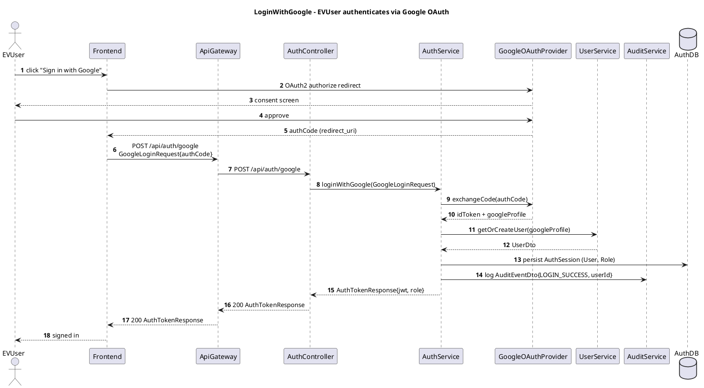

### Search Chargers

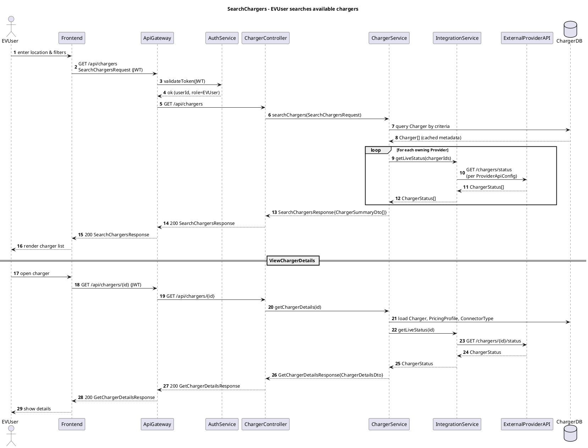

### Create Reservation

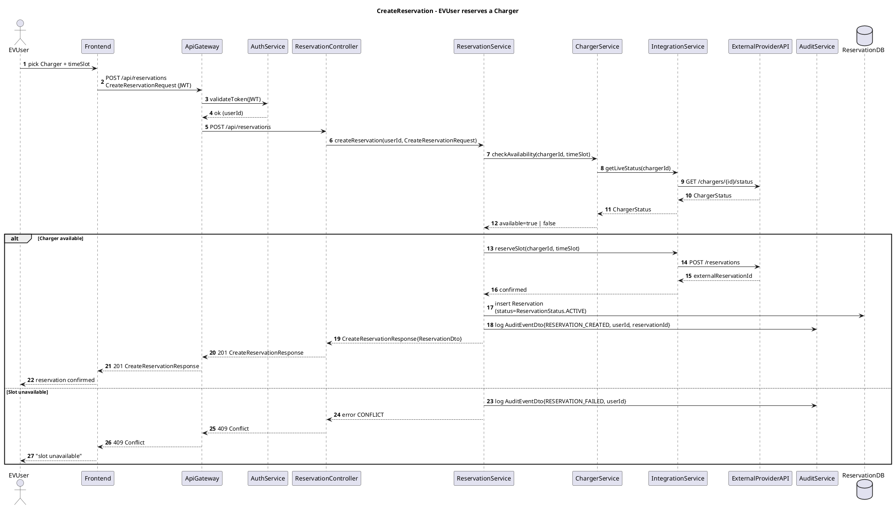

### Cancel Reservation

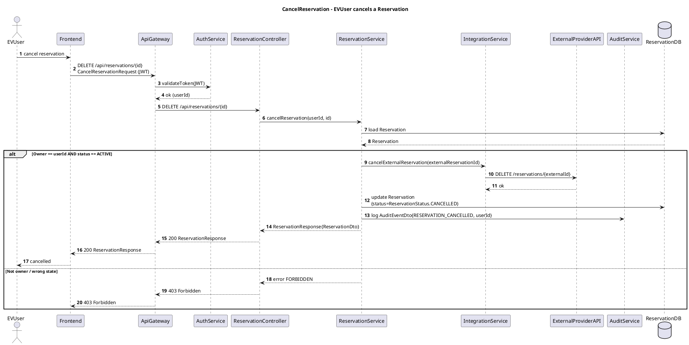

### Start / Stop Session

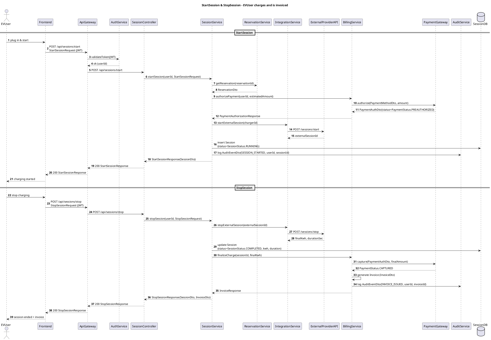

### Register Provider

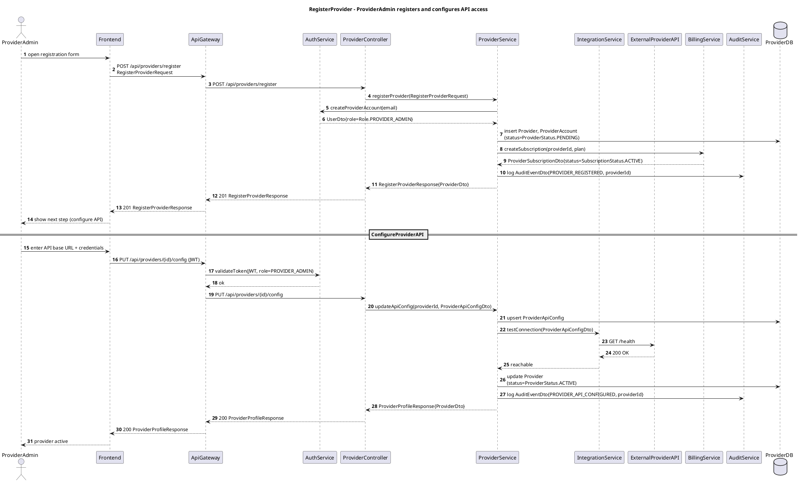

### Pay Provider Invoice

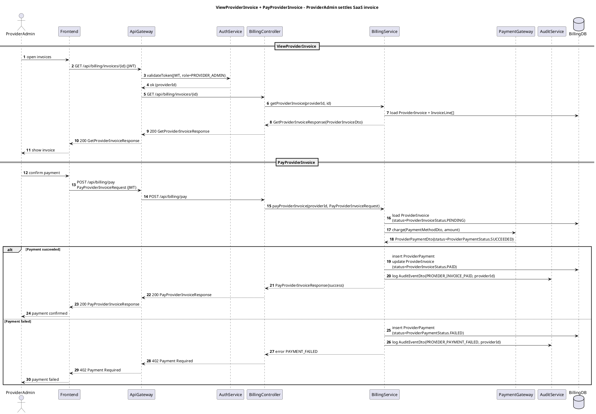

### Provider Analytics And Export

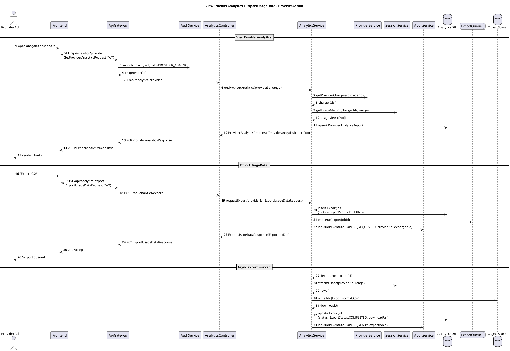

### View Global Analytics

```plantuml
@startuml ViewGlobalAnalytics
title ViewGlobalAnalytics - PlatformOperator

skinparam responseMessageBelowArrow true
autonumber

actor PlatformOperator
participant Frontend
participant ApiGateway
participant AuthService
participant AnalyticsController
participant AnalyticsService
participant ProviderService
participant SessionService
participant BillingService
participant AuditService
database "AnalyticsDB" as AnalyticsDB

PlatformOperator -> Frontend : open global dashboard
Frontend -> ApiGateway : GET /api/analytics/global\nGetGlobalAnalyticsRequest (JWT)
ApiGateway -> AuthService : validateToken(JWT, role=PLATFORM_OPERATOR)
AuthService --> ApiGateway : ok

ApiGateway -> AnalyticsController : GET /api/analytics/global
AnalyticsController -> AnalyticsService : getGlobalAnalytics(range)

par
    AnalyticsService -> ProviderService : getActiveProviders()
    ProviderService --> AnalyticsService : Provider[]
also
    AnalyticsService -> SessionService : getGlobalUsageMetrics(range)
    SessionService --> AnalyticsService : UsageMetricDto[]
also
    AnalyticsService -> BillingService : getRevenueSummary(range)
    BillingService --> AnalyticsService : revenueTotals
end

AnalyticsService -> AnalyticsDB : upsert GlobalAnalyticsReport
AnalyticsService -> AuditService : log AuditEventDto{GLOBAL_ANALYTICS_VIEWED}
AnalyticsService --> AnalyticsController : GlobalAnalyticsResponse{GlobalAnalyticsReportDto}
AnalyticsController --> ApiGateway : 200 GlobalAnalyticsResponse
ApiGateway --> Frontend : 200 GlobalAnalyticsResponse
Frontend --> PlatformOperator : render KPIs

@enduml
```

