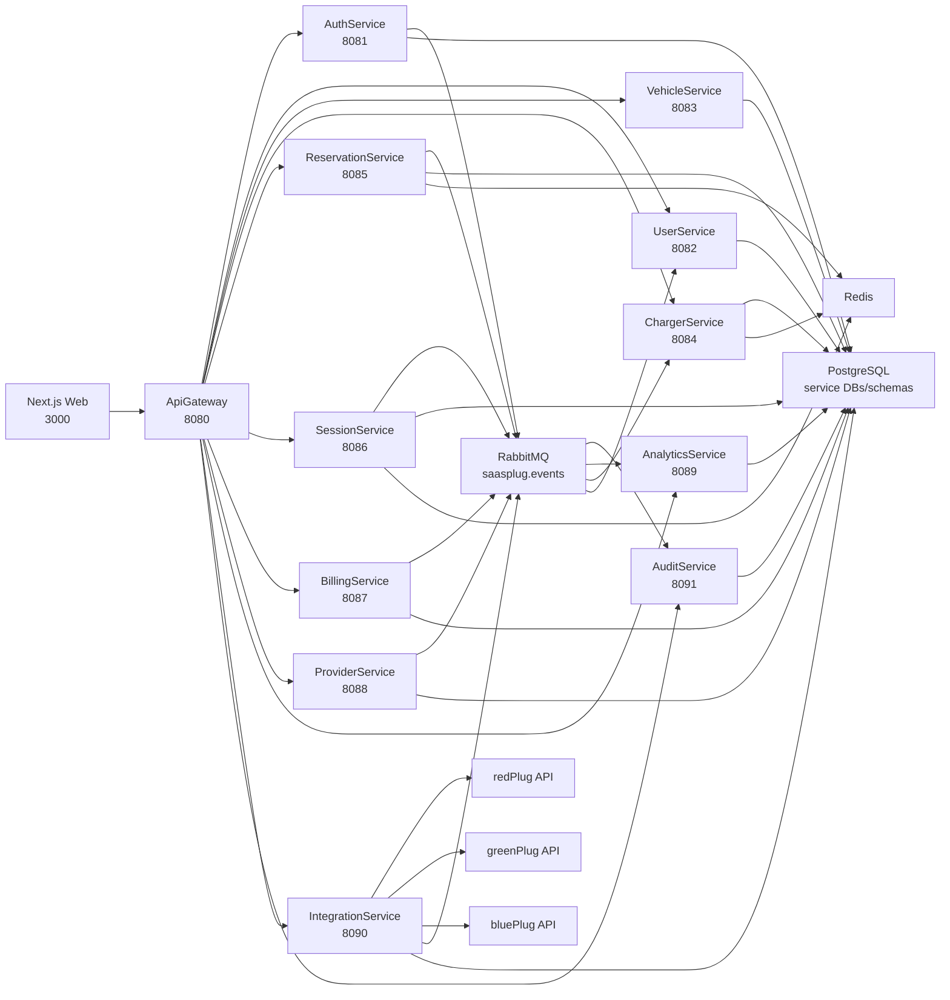

# saasPlug Project Study Guide

This document is a presentation and study guide for the saasPlug SaaS project. It explains what the app does, which services exist, how the data is split, how services communicate, what dependencies are used, how to run the system, and how to answer likely professor questions.

## 1. Project Summary

saasPlug is a SaaS platform for electric vehicle charging infrastructure. It supports three role-specific experiences:

- `EVUser`: searches for chargers, views charger details, reserves chargers, starts/stops charging sessions, manages vehicles, manages cards, and views billing history.
- `ProviderAdmin`: manages a charging provider account, configures external provider APIs, syncs chargers, views provider analytics, manages SaaS subscription/billing, and exports usage data.
- `PlatformOperator`: monitors the whole platform, views global analytics, provider status, global charger statistics, audit events, and global CSV exports.

The project evolved from a previous non-SaaS EV charger app into a microservices SaaS platform. The EV user map/reservation/session/payment features were reused and expanded, while provider/operator SaaS functionality, external provider integration, analytics, monitoring, RabbitMQ messaging, audit logging, Docker deployment, and database splitting were added.

## 2. Core Requirements Covered

- Role-based login and routing.
- EV user charger search/map/list.
- Charger details and reservation support.
- Charging sessions.
- EV user billing/payment methods.
- Provider signup/onboarding.
- Provider API configuration.
- Integration with professor APIs for `redPlug`, `greenPlug`, and `bluePlug`.
- Provider dashboard, owned charger map, analytics, subscription management, invoices, and exports.
- Platform operator dashboard, all-provider map, global analytics, operations, and exports.
- RabbitMQ service-to-service messaging.
- Audit event persistence.
- Monitor/health microservice.
- Docker Compose deployment and database seeding.

## 3. Architecture Overview

The frontend only talks to the API Gateway. The gateway forwards requests to the correct microservice. Services use HTTP when they need immediate answers and RabbitMQ when they publish events for other services to react to asynchronously.



## 4. Services and Ports

| Service | Internal port | Main route prefix | Responsibility |
| --- | ---: | --- | --- |
| Web | `3000` | N/A | Next.js frontend |
| ApiGateway | `8080` | `/api/v1/*` | Routes frontend requests |
| AuthService | `8081` | `/api/v1/auth` | Signup, signin, Google login, JWT roles |
| UserService | `8082` | `/api/v1/me` | User profile |
| VehicleService | `8083` | `/api/v1/cars`, `/api/v1/car-ownership` | Car catalog and EV user vehicles |
| ChargerService | `8084` | `/api/v1/points`, `/api/v1/chargers`, `/api/v1/admin/*` | Charger discovery/details/status/admin/pricing |
| ReservationService | `8085` | `/api/v1/reserve` | Reservation creation/cancellation |
| SessionService | `8086` | `/api/v1/newsession`, `/api/v1/sessions`, `/api/v1/charging` | Charging session start/stop/history |
| BillingService | `8087` | `/api/v1/payments` | EV billing, cards, provider invoices/subscriptions |
| ProviderService | `8088` | `/api/v1/providers` | Provider registration/profile/account |
| AnalyticsService | `8089` | `/api/v1/analytics` | Provider/global analytics and exports |
| IntegrationService | `8090` | `/api/v1/integration` | External provider APIs, sync, webhooks |
| AuditService | `8091` | `/api/v1/audit` | Audit event API and event consumer |
| MonitorService | `9090` | `/api/health` and dashboard | Health/status dashboard |

All backend services are separate Docker containers. The infra containers are Postgres, Redis, RabbitMQ, and `db-init`.

## 5. Docker and Running

### Local Default

```bash
docker compose up -d --build
```

Open:

- Web: `http://localhost:3000`
- API health: `http://localhost:8080/api/health`
- Monitor: `http://localhost:9090`
- RabbitMQ: `http://localhost:15672` (`guest` / `guest`)

### Presentation Server

Use `.env.example` to create the real `.env` on the server:

```bash
cp .env.example .env
docker compose up -d --build
```

Server presentation ports from `.env.example`:

| Component | Host port |
| --- | ---: |
| Web | `3302` |
| API Gateway | `4402` |
| Monitor | `5502` |
| Postgres | `6602` |
| Redis | `7702` |
| RabbitMQ AMQP | `8802` |
| RabbitMQ Management | `9902` |

Server URLs:

- Web: `http://147.102.112.123:3302`
- API health: `http://147.102.112.123:4402/api/health`
- Monitor: `http://147.102.112.123:5502`
- RabbitMQ management: `http://147.102.112.123:9902`

### Clean Reset

```bash
docker compose down -v
docker compose up -d --build
```

Use this when schemas changed or old Docker volumes are stale.

## 6. Seeded Demo Accounts

| Role | Email | Password |
| --- | --- | --- |
| EV user | `user@saasplug.local` | `admin123` |
| redPlug provider admin | `red@saasplug.local` | `admin123` |
| greenPlug provider admin | `green@saasplug.local` | `admin123` |
| bluePlug provider admin | `blue@saasplug.local` | `admin123` |
| Platform operator | `operator@saasplug.local` | `admin123` |

## 7. Databases and Data Ownership

Each persistent service has its own PostgreSQL database and schema namespace in Docker.

| Service | Database | Schema | Main data |
| --- | --- | --- | --- |
| AuthService | `saasplug_auth` | `auth_service` | Auth `User`, `Role`, password hash |
| UserService | `saasplug_user` | `user_service` | Profile user data |
| VehicleService | `saasplug_vehicle` | `vehicle_service` | `Car`, `CarOwnership`, `CarColor` |
| ChargerService | `saasplug_charger` | `charger_service` | `Charger`, `PricingProfile` |
| ReservationService | `saasplug_reservation` | `reservation_service` | `Reservation` |
| SessionService | `saasplug_session` | `session_service` | `Reservation` read model, `Session` |
| BillingService | `saasplug_billing` | `billing_service` | Payment methods, EV invoices, provider invoices, subscriptions, usage records |
| ProviderService | `saasplug_provider` | `provider_service` | Provider profile/account/subscription/chreg references |
| IntegrationService | `saasplug_integration` | `integration_service` | Provider API configs, synced chargers, webhooks |
| AnalyticsService | `saasplug_analytics` | `analytics_service` | Analytics read models, export jobs, metrics |
| AuditService | `saasplug_audit` | `audit_service` | `AuditEvent` |

Important explanation: the service schemas are not identical. Each service owns its own data and may keep read models needed for local queries. Cross-service behavior should use APIs/events rather than direct cross-database queries.

## 8. Database Initialization

Database setup is handled by:

- `scripts/docker-init-service-databases.sh`
- `scripts/docker-seed.ts`

The init script:

1. Creates service databases.
2. Runs `prisma db push` for each service schema.
3. Seeds data per service using `SEED_SERVICE_NAME`.

The seed script creates demo users, provider accounts, provider API configs, car catalog rows, provider invoices/usage records, analytics-friendly sessions, and synced charger data where possible.

## 9. API Gateway Routing

The gateway forwards requests by URL prefix.

| Prefix | Service |
| --- | --- |
| `/api/v1/auth` | AuthService |
| `/api/v1/me` | UserService |
| `/api/v1/cars`, `/api/v1/car-ownership` | VehicleService |
| `/api/v1/points`, `/api/v1/chargers`, `/api/v1/admin` | ChargerService |
| `/api/v1/reserve` | ReservationService |
| `/api/v1/newsession`, `/api/v1/sessions`, `/api/v1/charging` | SessionService |
| `/api/v1/payments` | BillingService |
| `/api/v1/providers` | ProviderService |
| `/api/v1/integration` | IntegrationService |
| `/api/v1/analytics` | AnalyticsService |
| `/api/v1/audit` | AuditService |

The gateway is not the business logic layer. It is the synchronous entry point and routing layer.

## 10. Authentication and Roles

AuthService exposes:

- `POST /api/v1/auth/signup`
- `POST /api/v1/auth/signin`
- `POST /api/v1/auth/google`

JWT payload includes:

- `userId`
- `role`
- `iat`
- `exp`

Frontend role routing:

- `EV_USER` -> `/`
- `PROVIDER_ADMIN` -> `/provider`
- `PLATFORM_OPERATOR` -> `/operator`

Protected services verify the JWT with shared `JWT_SECRET`.

## 11. Frontend Pages

Frontend root: `apps/web`.

| Page | Purpose |
| --- | --- |
| `/` | EV user charger map/list |
| `/signin` | Sign in |
| `/signup` | EV user signup |
| `/signup/provider` | Provider signup/onboarding |
| `/provider` | Provider admin console |
| `/operator` | Platform operator console |
| `/profile` | EV user profile |
| `/vehicles` | EV vehicle management |
| `/billing` | EV user payment methods/history |
| `/report-problem` | Problem reporting |

Important frontend files:

- `apps/web/src/utils/api.ts`: API helpers and auth token handling.
- `apps/web/src/components/MainScreen.tsx`: EV user main map/list screen.
- `apps/web/src/components/ChargerDetails.tsx`: reservation/detail UI.
- `apps/web/src/components/StatsChargerMap.tsx`: provider/operator map with charger stats.
- `apps/web/src/app/provider/page.tsx`: provider console.
- `apps/web/src/app/operator/page.tsx`: operator console.

## 12. Role-Specific UI

### EV User

EV users can:

- View chargers on a map/list.
- Filter/search chargers.
- View charger details and prices.
- Reserve chargers if provider supports reservation.
- Start/stop charging sessions.
- Add vehicles.
- Manage payment methods.
- View billing history.

### Provider Admin

Provider admins can:

- See dashboard first.
- Sync external provider chargers.
- View only their own provider chargers.
- View owned charger map and per-charger stats.
- View analytics.
- Create/download provider CSV exports.
- Manage SaaS subscription and provider invoices.
- Update provider profile/API configuration.

### Platform Operator

Operators can:

- See global dashboard first.
- View all-provider analytics.
- View all synced chargers on a global map.
- View provider breakdowns.
- Create/download global exports.
- Inspect platform operations and audit events.

## 13. External Provider APIs

The assignment provider APIs are:

| Provider | Base URL | List | Details | Reserve/Hold |
| --- | --- | --- | --- | --- |
| redPlug | `https://davinci.softlab.ntua.gr/saas26/redPlug/api` | `/points` | `/point/:pointid` | `/reserve/:pointid`, `/reserve/:pointid/:minutes` |
| greenPlug | `https://davinci.softlab.ntua.gr/saas26/greenPlug/api` | `/chargingPoints` | `/chargingPoints/:pointid` | `/chargingPoints/:pointid/reservations` |
| bluePlug | `https://davinci.softlab.ntua.gr/saas26/bluePlug/api` | `/locations` | `/location/:pointid/status` | `/location/:pointid/hold?minutes=` |

The API key is passed as a bearer token. The app uses:

```text
INTEGRATION_DEFAULT_API_KEY=sk_saas_954d32147669212952846e05
```

IntegrationService normalizes these different APIs into one internal charger shape.

## 14. IntegrationService

IntegrationService owns external-provider communication.

Main endpoints:

- `POST /api/v1/integration/config`
- `GET /api/v1/integration/config`
- `POST /api/v1/integration/sync`
- `GET /api/v1/integration/chargers`
- `POST /api/v1/integration/webhooks`
- `GET /api/v1/integration/webhooks`
- `GET /api/v1/integration/webhooks/events`
- `GET /api/v1/internal/provider-chargers`
- `POST /api/v1/internal/provider-chargers/:chargerId/reserve`

Provider/operator maps now use AnalyticsService, and AnalyticsService prefers synced charger data from IntegrationService. This prevents the statistics maps from showing only the tiny demo charger subset when IntegrationService has the full red/green/blue synced data.

## 15. ProviderService

ProviderService owns provider identity and profile data.

Main endpoints:

- `POST /api/v1/providers/register`
- `POST /api/v1/providers/seed-demo`
- `GET /api/v1/providers/me`
- `PATCH /api/v1/providers/me`
- `GET /api/v1/providers/me/chargers`

Provider signup/onboarding creates an auth user and links that user to a provider account.

## 16. ChargerService

ChargerService owns charger search/details/status data.

Main endpoints:

- `GET /api/v1/points`
- `GET /api/v1/point/:id`
- `GET /api/v1/chargers`
- `GET /api/v1/chargers/:id`
- `GET /api/v1/pointstatus/:id/:from/:to`
- `POST /api/v1/updpoint/:id`
- `POST /api/v1/admin/chargers`
- `PATCH /api/v1/admin/chargers/:id`
- `DELETE /api/v1/admin/chargers/:id`
- `POST /api/v1/admin/pricing/update`

ChargerService should not directly query ReservationService or SessionService tables. It uses internal service endpoints/read models where needed.

## 17. ReservationService

ReservationService owns reservation creation/cancellation.

Main endpoints:

- `POST /api/v1/reserve/:id`
- `POST /api/v1/reserve/:id/:minutes`
- `POST /api/v1/reserve/:id/cancel`
- `GET /api/v1/internal/reservations/active`
- `GET /api/v1/internal/reservations/history/:chargerId/:from/:to`
- `GET /api/v1/internal/reservations/:id`
- `POST /api/v1/internal/reservations/:id/expire`

It can call IntegrationService when the reservation must be reflected in an external provider API.

## 18. SessionService

SessionService owns active/completed charging sessions.

Main endpoints:

- `POST /api/v1/newsession`
- `GET /api/v1/sessions/my-history`
- `GET /api/v1/sessions/:id/:from/:to`
- `POST /api/v1/charging/start`
- `POST /api/v1/charging/stop`
- `GET /api/v1/internal/sessions/history/:chargerId/:from/:to`

Session events feed billing, analytics, and audit.

## 19. BillingService

BillingService owns EV user payments and provider SaaS billing.

EV user endpoints under `/api/v1/payments`:

- `POST /create-setup-intent`
- `POST /save-method`
- `GET /methods`
- `DELETE /methods/:id`
- `POST /charge`
- `GET /history`
- `POST /pay-balance`

Provider billing endpoints under `/api/v1/payments/provider`:

- `GET /subscription`
- `POST /subscription/start`
- `POST /payments/confirm`
- `GET /invoices`
- `GET /invoices/:id`
- `POST /invoices/:id/pay`
- `POST /seed-demo-invoice`

Stripe is used when a real test secret exists. Mock behavior keeps the demo runnable without depending on real card charging.

## 20. AnalyticsService

AnalyticsService owns provider/global analytics and exports.

Endpoints:

- `GET /api/v1/analytics/provider`
- `GET /api/v1/analytics/global`
- `POST /api/v1/analytics/exports`
- `GET /api/v1/analytics/exports`
- `GET /api/v1/analytics/exports/:id/download`

Supported export types:

- `USAGE_RECORDS`
- `PROVIDER_DAILY`
- `PROVIDER_CHARGERS`
- `GLOBAL_PROVIDERS`
- `GLOBAL_CHARGERS`

The provider/operator UI date inputs now send `from` and `to` to analytics and export creation. This means visible analytics and new CSV exports follow the selected date range.

## 21. AuditService

AuditService consumes RabbitMQ events and stores audit records.

Endpoint:

- `GET /api/v1/audit/events`

This is operator-protected and useful for explaining traceability.

## 22. MonitorService

MonitorService is a separate health UI/API.

It checks:

- Internal microservice health endpoints.
- PostgreSQL reachability.
- Redis reachability.
- RabbitMQ AMQP and management.
- Gateway smoke checks.
- Demo login.
- External provider API reachability.

Default local URL:

```text
http://localhost:9090
```

Presentation URL:

```text
http://147.102.112.123:5502
```

## 23. RabbitMQ

RabbitMQ is the asynchronous messaging backbone.

Main exchange:

```text
saasplug.events
```

Important events:

- `user.registered`
- `provider.registered`
- `charger.upserted`
- `reservation.created`
- `reservation.cancelled`
- `reservation.expired`
- `session.started`
- `session.stopped`
- `billing.provider_invoice.created`
- `billing.provider_invoice.paid`
- `integration.chargers.synced`

What RabbitMQ solves:

- Services do not need to call every interested service directly.
- Events can fan out to audit, analytics, billing, charger read models, etc.
- If a consumer is temporarily down, messages can wait in a queue.
- New services can subscribe without changing the original publisher.

Short explanation:

> HTTP is for questions that need an immediate answer. RabbitMQ is for facts that happened and may interest multiple services.

## 24. Redis

Redis is a fast temporary coordination store.

It is used around:

- Charger availability.
- Reservation/session coordination.
- Short-lived state and locks.

PostgreSQL remains the persistent source of truth. Redis is for fast-changing operational state.

Short explanation:

> Redis answers "what is the current fast-changing state?" RabbitMQ answers "something happened, who needs to know?"

## 25. Dependencies

### Where Dependencies Live

| File | Meaning |
| --- | --- |
| `package.json` | Root workspace scripts |
| `package-lock.json` | Exact locked package versions |
| `apps/web/package.json` | Frontend dependencies |
| `services/*/package.json` | Service dependencies |
| `tools/cli-client/package.json` | CLI testing tool dependencies |

### Frontend Dependencies

| Dependency | Purpose |
| --- | --- |
| `next` | React framework, app routing, production build |
| `react`, `react-dom` | UI runtime |
| `tailwindcss` | Styling |
| Radix UI packages | Accessible dialogs, tabs, popovers, forms, sheets, etc. |
| `lucide-react` | Icons |
| `pigeon-maps` | Charger maps |
| `recharts` | Analytics charts |
| `@stripe/react-stripe-js`, `@stripe/stripe-js` | Card setup/payment UI |
| `@react-oauth/google` | Google sign-in |
| `react-hook-form`, `@hookform/resolvers` | Forms |
| `class-variance-authority`, `clsx`, `tailwind-merge` | Component class composition |
| `sonner` | Toast notifications |
| `date-fns` | Date utilities |

### Common Backend Dependencies

| Dependency | Purpose |
| --- | --- |
| `express` | HTTP APIs/routes |
| `cors` | Cross-origin support |
| `dotenv` | Environment variables |
| `typescript` | Static typing |
| `tsx` | Run TypeScript directly |
| `@prisma/client`, `prisma` | Database client/schema tooling |
| `jsonwebtoken` | JWT verification |
| `zod` | Runtime request validation |

### Service-Specific Dependencies

| Dependency | Used for |
| --- | --- |
| `bcryptjs` | Password hashing |
| `google-auth-library` | Google token verification |
| `stripe` | Payment setup/payment flows |
| `amqplib` | RabbitMQ publishing/consuming |
| `redis` | Availability/session/reservation coordination |
| `csv-parse` | CSV seed/import data |
| `axios` | HTTP helper in charger/pricing code |
| `multer` | Admin upload flows |
| `xml2js` | XML parsing for pricing/energy data |
| `vitest` | Test runner |
| `supertest` | HTTP route testing for Express apps |

### Infrastructure Images

| Image | Purpose |
| --- | --- |
| `postgres:15` | Relational database |
| `redis:7` | Cache/coordination |
| `rabbitmq:3-management` | Message broker and management UI |
| `node:22-bookworm-slim` | Base image for app containers |

## 26. Testing and Build Commands

Build frontend:

```bash
npm --prefix apps/web run build
```

Build all services:

```bash
npm run build:services
```

Useful individual checks:

```bash
npm --prefix services/analytics-service run build
npm --prefix services/integration-service run build
npm --prefix services/billing-service test
npm --prefix services/provider-service test
npm --prefix services/integration-service test
```

CLI tests:

```bash
npm run test:cli
```

## 27. Demo Flow

1. Start the app:

   ```bash
   cp .env.example .env
   docker compose up -d --build
   ```

2. Open monitor:

   ```text
   http://147.102.112.123:5502
   ```

3. Login as EV user:

   ```text
   user@saasplug.local / admin123
   ```

   Show charger map, details, vehicles, billing, reservation flow.

4. Login as provider:

   ```text
   red@saasplug.local / admin123
   ```

   Show provider dashboard, synced chargers, provider stats map, analytics, exports, subscription.

5. Login as operator:

   ```text
   operator@saasplug.local / admin123
   ```

   Show global dashboard, provider breakdown, global map, exports.

6. Show RabbitMQ management if needed:

   ```text
   http://147.102.112.123:9902
   ```

7. Show API health:

   ```text
   http://147.102.112.123:4402/api/health
   ```

## 28. Smoke Test Commands

Signin:

```bash
curl -s -X POST http://localhost:8080/api/v1/auth/signin \
  -H "Content-Type: application/json" \
  -d '{"email":"user@saasplug.local","password":"admin123"}'
```

Charger list:

```bash
curl -s http://localhost:8080/api/v1/points
```

Health:

```bash
curl -s http://localhost:8080/api/health
curl -s http://localhost:9090/api/health
```

## 29. Likely Professor Questions

### Is every service a separate container?

Yes. Every microservice is its own container. They use a shared Dockerfile pattern, but each runs a different package command.

### Are services separate repos?

No. This is a monorepo. Microservices do not require separate repositories. The important boundaries are separate services, containers, runtime processes, routes, and databases/schemas.

### What is the orchestrator?

The synchronous orchestrator is ApiGateway. For async workflows, RabbitMQ coordinates events through publishers and consumers.

### What does Express do if service communication uses messaging?

Express exposes REST APIs for browser/gateway requests and immediate service-to-service calls. RabbitMQ handles async events. Both are needed.

### What does Zod do?

Zod validates real runtime JSON at API boundaries. TypeScript checks code at build time; Zod checks request data when the service receives it.

### What does Supertest do?

Supertest lets tests call Express endpoints without manually starting Postman or the whole app. Vitest runs tests; Supertest performs HTTP assertions.

### Why use RabbitMQ instead of HTTP for everything?

Messaging reduces coupling, supports fan-out, allows retry/queue behavior, and lets services react independently to events such as `session.stopped` or `provider.registered`.

### Why use Redis?

Redis supports fast, temporary charger availability/session/reservation coordination. It is not the main database.

### How are external providers handled?

IntegrationService has provider-specific adapters for redPlug, greenPlug, and bluePlug, then normalizes responses into internal charger data.

### Why separate ProviderService and IntegrationService?

ProviderService owns business identity and account/profile data. IntegrationService owns technical external API communication and synced provider charger mappings.

### Do analytics exports respect date range?

Yes. Provider/operator date inputs pass `from` and `to` to AnalyticsService, and new exports are generated for the selected range.

## 30. Important Files

| Area | Path |
| --- | --- |
| Compose | `docker-compose.yml` |
| Presentation env template | `.env.example` |
| DB init | `scripts/docker-init-service-databases.sh` |
| Seed | `scripts/docker-seed.ts` |
| Frontend API helper | `apps/web/src/utils/api.ts` |
| Provider UI | `apps/web/src/app/provider/page.tsx` |
| Operator UI | `apps/web/src/app/operator/page.tsx` |
| Gateway | `services/api-gateway/src/index.ts` |
| Provider adapters | `services/integration-service/src/adapters/externalProviderApi.ts` |
| Analytics | `services/analytics-service/src/controllers/analyticsController.ts` |
| Audit | `services/audit-service` |
| Monitor | `services/monitor-service` |
| Canonical names | `architecture/canonical-naming.md` |
| UML overview | `architecture/saasplug-uml.md` |
| AI log | `docs/ai-usage-log.md` |

## 31. One-Minute Explanation

saasPlug is a role-based EV charging SaaS platform. EV users find, reserve, charge, and pay. Provider admins connect their infrastructure APIs, monitor owned chargers, manage subscription billing, and export usage. Platform operators monitor all providers and global usage.

Technically, the app uses a Next.js frontend, an Express API Gateway, and separate backend microservices for auth, users, vehicles, chargers, reservations, sessions, billing, providers, integration, analytics, audit, and monitoring. PostgreSQL is split into service-owned databases/schemas, Redis supports fast availability/session coordination, RabbitMQ carries domain events, and Docker Compose runs everything reproducibly for the demo.
